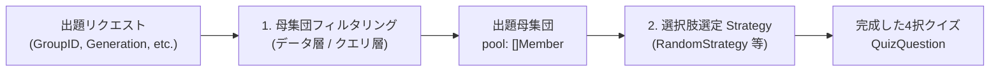

# 0018. クイズ出題における母集団フィルタリング設計の分離 (0018-quiz-candidate-pool-filtering-architecture.md)

- **ステータス**: 承認 (Accepted)
- **日付**: 2026-10-03

---

## 1. 背景と解決すべき課題 (Context & Problem)

ユーザー体験において「4期生だけ出題」「櫻坂46だけ出題」といったプレイモードは重要な機能です。
しかし、これを「出題アルゴリズム（Strategy）」の一部として実装しようとすると、以下の問題が生じます：

1. **責務の混同**: 期生やグループの絞り込みは本質的に「データ抽出（WHERE 句またはスライスのフィルタリング）」であり、選択肢の選出ロジック（4択の作り方）とは無関係である。
2. **Strategy の肥大化**: 新しい絞り込み条件（例: 「期生指定」「選抜/アンダー」「卒業生含む」）が増えるたびに Strategy の種類が増殖し、テストと保守性が破綻する。

---

## 2. 決定事項と具現化仕様 (Decision & Specification)

クイズ出題の処理パイプラインを **「1. 母集団フィルタリング (Filtering)」** と **「2. 選択肢選定 (Strategy)」** の 2 つの独立した責務に完全分離する。



### 具現化仕様

1. **母集団フィルター (`QuizFilter`)**:
   ```go
   type QuizFilter struct {
       GroupID    *ID  // 特定グループ絞り込み (任意)
       Generation *int // 期生絞り込み (任意)
   }
   ```
2. **2段階の責務境界**:
   - **前処理 (Filter)**: リポジトリまたはメモリ内のメンバーマスタから、`QuizFilter` に合致する `[]Member`（母集団）を抽出する。
   - **アルゴリズム (Strategy)**: 抽出された母集団から、正解 1 件と重複しない誤答 3 件を選定する（[ADR-0009](./0009-quiz-generation-strategy-pattern.md)）。
3. **バリデーション**:
   - 抽出された母集団の件数が 4 択クイズを構成する最小数（4名以上）に満たない場合は、エラー（Problem Details `ERR_INVALID_INPUT`）を返却する。

---

## 3. 採否の根拠と得られる効果 (Rationale & Consequences)

- **Strategy の純粋化**: Strategy は外部のグループ概念や期生ルールを知る必要がなくなり、「与えられたスライスから 4 つ選ぶ」だけのシンプルなロジックになる。
- **直交性の確保**: 「どのグループ・期生から出すか（Filter）」と「どう選定するか（Strategy）」が直交するため、任意のフィルターと任意の Strategy を自由に組み合わせられる。
- **テスト容易性**: 母集団フィルターのテスト（データ抽出テスト）と Strategy のテスト（シャッフル・重複排除テスト）を完全に分離して独立に単体テストできる。
