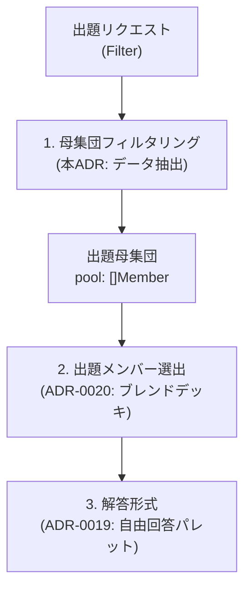

# 0018. クイズ出題における母集団フィルタリング設計の分離 (0018-quiz-candidate-pool-filtering-architecture.md)

- **ステータス**: 承認 (Accepted)
- **日付**: 2026-10-03

---

## 1. 背景と解決すべき課題 (Context & Problem)

ユーザー体験において「4期生だけ出題」「櫻坂46だけ出題」といったプレイモードは重要な機能です。
しかし、これを「出題アルゴリズム（Strategy）」の一部として実装しようとすると、以下の問題が生じます：

1. **責務の混同**: 期生やグループの絞り込みは本質的に「データ抽出（WHERE 句またはスライスのフィルタリング）」であり、選択肢の選出ロジック（4択の作り方）とは無関係である。
2. **Strategy の肥大化**: 新しい絞り込み条件（例: 「期生指定」「選抜/アンダー」「卒業生含む」）が増えるたびに Strategy の種類が増殖し、テストと保守性が破綻する。

---

## 2. 決定事項と具現化仕様 (Decision & Specification)

クイズ出題の処理パイプラインにおいて、**「母集団フィルタリング (Filtering)」** を独立したデータ抽出（前処理）責務として分離する。



### 具現化仕様

1. **母集団フィルター (`QuizFilter`)**:
   ```go
   type QuizFilter struct {
       // グループ絞り込み (nil の場合は全グループ対象)
       GroupID *ID `json:"group_id,omitempty"`

       // 期生絞り込み (空の場合は全期生対象。複数指定可: 例 [3, 4])
       Generations []int `json:"generations,omitempty"`

       // 衣装・写真種別絞り込み (ADR-0021。指定時は該当衣装を持つメンバーのみ抽出)
       PhotoTypeIDs []ID `json:"photo_type_ids,omitempty"`

       // 卒業生フラグ (false: 現役 active のみ / true: 卒業生 graduated も含む)
       IncludeGraduated bool `json:"include_graduated"`
   }
   ```
2. **責務境界**:
   - **前処理 (本ADR)**: リポジトリまたはメモリ内のメンバーマスタから、`QuizFilter` に合致する `[]Member`（母集団）を抽出する。
   - **衣装フィルタ連動**: `PhotoTypeIDs` が指定された場合、その衣装の `MemberImage` を保持しているメンバーのみを抽出し、出題画像も該当衣装を優先する。
   - **後続パイプライン**: 抽出された母集団を [ADR-0020](./0020-quiz-target-member-selection-strategy.md)（ブレンドデッキ選出）へ引き渡す。
3. **バリデーション**:
   - 抽出された母集団の件数が出題に必要な最小数（4名未満など）に満たない場合は、エラー（`ErrInsufficientCandidates` / Problem Details `ERR_INVALID_INPUT`）を返却する。

---

## 3. 採否の根拠と得られる効果 (Rationale & Consequences)

- **Strategy の純粋化**: Strategy は外部のグループ概念や期生ルールを知る必要がなくなり、「与えられたスライスから 4 つ選ぶ」だけのシンプルなロジックになる。
- **直交性の確保**: 「どのグループ・期生から出すか（Filter）」と「どう選定するか（Strategy）」が直交するため、任意のフィルターと任意の Strategy を自由に組み合わせられる。
- **テスト容易性**: 母集団フィルターのテスト（データ抽出テスト）と Strategy のテスト（シャッフル・重複排除テスト）を完全に分離して独立に単体テストできる。
