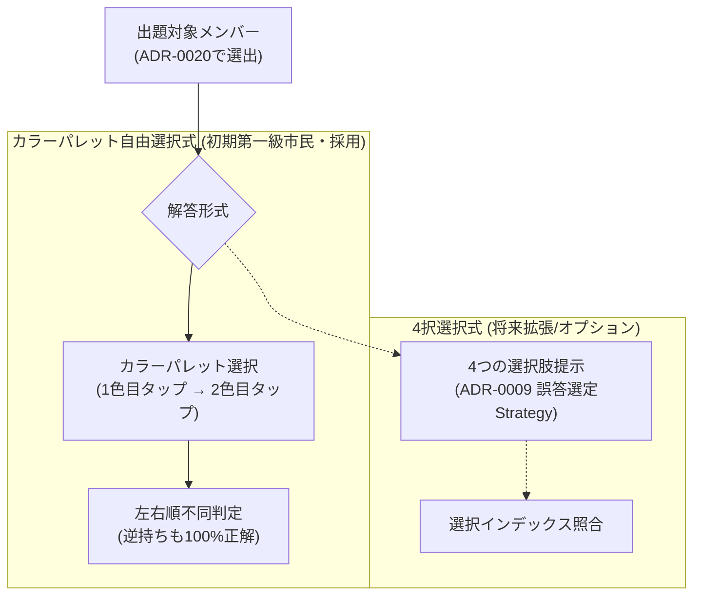

# 0019. 解答形式 Strategy と自由回答（カラーパレット選択）設計の採用 (0019-quiz-format-strategy-and-color-palette-architecture.md)

- **ステータス**: 承認 (Accepted)
- **日付**: 2026-10-04

---

## 1. 背景と解決すべき課題 (Context & Problem)

旧システムおよび初期設計では、クイズの解答方式として「4択選択式（Multiple Choice）」のみを暗黙の前提としていました。
しかし、ライブ会場やファンの実態を考慮すると、以下の課題と要望が存在します：

1. **実用性とゲーム性のギャップ**:
   - ライブ会場でファンが直面する実際の課題は、「目の前に推しが来たとき、手元の公式ペンライト（15〜20色程度）から即座に2色を正しく点灯できるか」です。
   - 4択問題はカジュアルな反面、消去法で当たってしまうため、実際のライブ現場での即応力トレーニングとしては「全色パレットから左右の2色を直接選ぶ自由回答」の方が圧倒的に実用的で熱量が高い。
2. **解答形式の硬直化**:
   - 4択式、カラーパレット自由選択式、色を見てメンバー名を当てる逆引き式など、解答形式そのものが複数存在するため、コード側で4択構造（`Options []QuizOption`）に固定してしまうと将来の形式拡張が困難になる。

---

## 2. 決定事項と具現化仕様 (Decision & Specification)

解答形式に **「自由回答（カラーパレット選択式）」** を第一級市民（デフォルト形式）として正式採用する。4択選択式はオプション/カジュアルモードとして将来または後続フェーズで連携可能とする。



### 具現化仕様

1. **カラーパレット自由選択式の操作仕様**:
   - 出題: 対象メンバーの顔写真・名前（漢字/かな）・期生。
   - 解答UI: 画面下部に公式カラーパレット（15〜20色のボタン）。
   - タップ操作:
     - 1タップ目: 左手ペンライト色をセット。
     - 2タップ目: 右手ペンライト色をセットし、**即座に正誤判定**（送信ボタン不要）。
     - 同色2本（白×白など）の場合は同一色ボタンを 2 回連続タップで選択。
2. **左右順不同判定 (`JudgeAnswer`)**:
   - ファンのペンライト持ち替え実態を考慮し、左右の並び順は問わない。
   - `(L == ans.L && R == ans.R) || (L == ans.R && R == ans.L)` で正解と判定する。
3. **判定関数仕様**:
   ```go
   func JudgeAnswer(leftColorID, rightColorID ID, target Member) bool
   ```

---

## 3. 採否の根拠と得られる効果 (Rationale & Consequences)

- **解答体験の柔軟性**:
  - カラーパレット式と4択選択式の両方を視野に入れ、UIとゲームルールに応じた切り替えを可能にする。
- **ライブ現場での最高の実用性**:
  - 「直感で2色を当てる」という体験は、ファンにとって最も刺さるライブ予習・暗記ツールとなる。
- **アーキテクチャの直交性**:
  - 「母集団の抽出（[ADR-0018](./0018-quiz-candidate-pool-filtering-architecture.md)）」「出題メンバー選出（[ADR-0020](./0020-quiz-target-member-selection-strategy.md)）」「解答形式（本ADR）」「4択時の誤答選定（[ADR-0009](./0009-quiz-generation-strategy-pattern.md)）」の 4 つが互いに疎結合となり、UI側で自由に組み合わせ可能になる。
