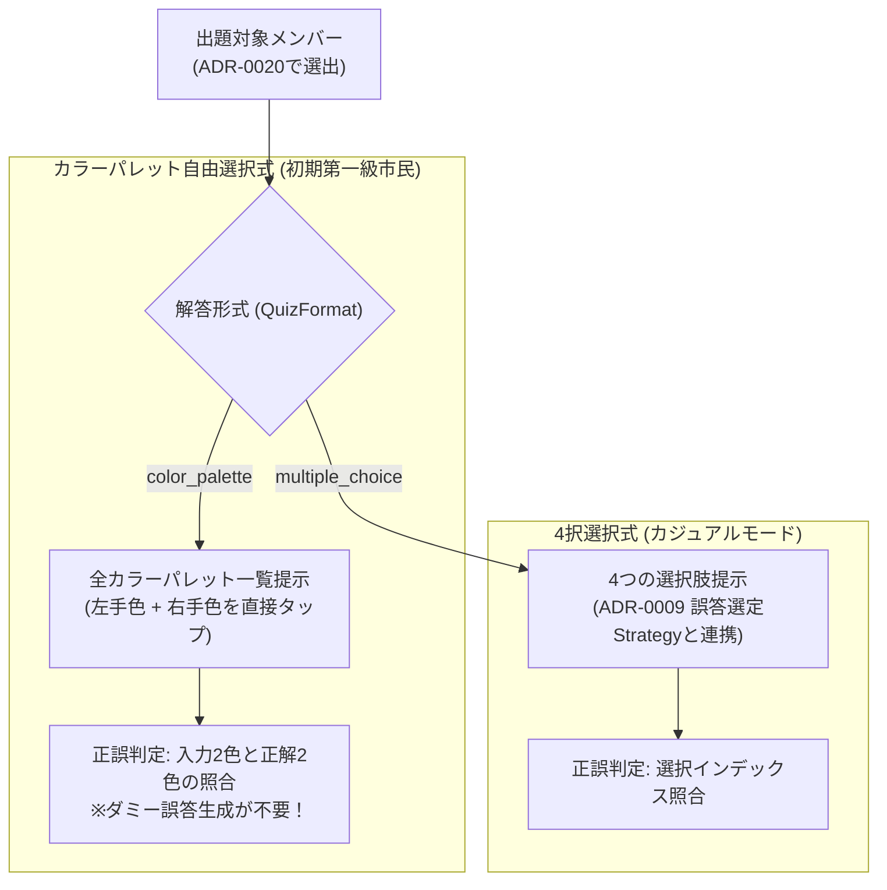

# 0019. 解答形式 Strategy と自由回答（カラーパレット選択）設計の採用 (0019-quiz-format-strategy-and-color-palette-architecture.md)

- **ステータス**: 提案中 (Proposed) - ※Strategyパターン自体は現時点ではfixせず検討対象として保持
- **日付**: 2026-10-03

---

## 1. 背景と解決すべき課題 (Context & Problem)

旧システムおよび初期設計では、クイズの解答方式として「4択選択式（Multiple Choice）」のみを暗黙の前提としていました。
しかし、ライブ会場やファンの実態を考慮すると、以下の課題と要望が存在します：

1. **実用性とゲーム性のギャップ**:
   - ライブ会場でファンが直面する実際の課題は、「目の前に推しが来たとき、手元の公式ペンライト（15〜20色程度）から即座に2色を正しく点灯できるか」です。
   - 4択問題はカジュアルな反面、消去法で当たってしまうため、実際のライブ現場での即応力トレーニングとしては「全色パレットから左右の2色を直接選ぶ自由回答」の方が圧倒的に実用的で熱量が高い。
2. **解答形式の硬直化**:
   - 4択式、カラーパレット自由選択式、色を見てメンバー名を当てる逆引き式など、解答形式そのものが複数存在するため、コード側で4択構造（`Options []QuizOption`）に固定してしまうと将来の形式拡張が困難になる。

---

## 2. 決定事項と具現化仕様 (Decision & Specification)

解答形式そのものを **Strategy パターン (`QuizFormat`)** として設計し、初期実装から **「自由回答（カラーパレット選択式）」** を第一級市民として正式採用する。



### 具現化仕様

1. **解答形式インターフェース (`QuizFormat`)**:
   ```go
   type QuizFormat interface {
       Type() string // "color_palette" | "multiple_choice"
       BuildQuestion(ctx context.Context, target Member, pool []Member, allColors []Color) (QuizQuestion, error)
       JudgeAnswer(input AnswerInput, target Member) bool
   }
   ```
2. **2つの提供形式**:
   - **`color_palette`（カラーパレット自由選択式・推奨）**:
     - 出題: 対象メンバーの情報（名前・期生・写真）。
     - 解答UI: グループ公式の全ペンライトカラー一覧（15〜20色）を提示し、ユーザーが「左手」「右手」の2色を選択。
     - 特徴: **ダミー誤答の生成が不要**。純粋な2色照合（順不同許容）で判定。
   - **`multiple_choice`（4択選択式）**:
     - 出題: 対象メンバーと 4 つのカラーペア選択肢（正解 1 + 誤答 3）。
     - 誤答選定: [ADR-0009](./0009-quiz-generation-strategy-pattern.md) の `OptionSelectionStrategy`（初期は `random`）によって誤答を生成。
3. **判定ロジック（順不同の許容）**:
   - ペンライトカラーは「左手・右手の持ち替え」が日常的であるため、判定は左右の順序を問わず `(L == ans.L && R == ans.R) || (L == ans.R && R == ans.L)` で正解とみなす。

---

## 3. 採否の根拠と得られる効果 (Rationale & Consequences)

- **ダミー誤答アルゴリズムの複雑さからの解放**:
  - 自由回答（カラーパレット式）ではダミー誤答を計算・生成する必要が一切ないため、初期実装の計算コストとバグ混入リスクが極小化される。
- **ライブ現場での最高の実用性**:
  - 「全色から直感で2色を当てる」という体験は、ファンにとって最も刺さるライブ予習・暗記ツールとなる。
- **アーキテクチャの直交性**:
  - 「母集団の抽出（[ADR-0018](./0018-quiz-candidate-pool-filtering-architecture.md)）」「出題メンバー選出（[ADR-0020](./0020-quiz-target-member-selection-strategy.md)）」「解答形式（本ADR）」「4択時の誤答選定（[ADR-0009](./0009-quiz-generation-strategy-pattern.md)）」の 4 つが互いに疎結合となり、UI側で自由に組み合わせ可能になる。
