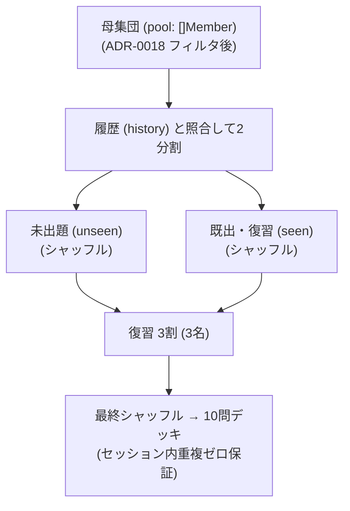

# 0020. 出題対象メンバー選出におけるブレンドデッキ戦略の採用 (0020-quiz-target-member-selection-strategy.md)

- **ステータス**: 承認 (Accepted)
- **日付**: 2026-10-04

---

## 1. 背景と解決すべき課題 (Context & Problem)

クイズ出題において最も本質的な体験は、**「誰を問題として出題するか（出題対象メンバーの選出）」** です。
完全ランダムや単純な周回（全員解き終わるまで再登場しない方式）には以下の課題が存在しました：

1. **未出題の死角（クーポンコレクター問題）**: 単純ランダムでは、3回連続で出るメンバーがいる一方で、50問解いても一度も出ない不遇なメンバーが統計的に発生する。
2. **完全周回の退屈さ**: 全員（73名）を解き切るまで推しメンや前に解いたメンバーが二度と出ないため、暗記の復習・定着感が薄れる。
3. **セッション内の興醒め重複**: 10問1セットを解いている最中に同一メンバーが2回出るとプレイ感が著しく損なわれる。

---

## 2. 決定事項と具現化仕様 (Decision & Specification)

出題メンバー選出に **「ブレンドデッキ戦略 (Blended Deck Strategy)」** を正式採用する。
回答履歴 (`history []AnswerLog`) を参照し、**「未出題枠（約7割）」** と **「復習・再登場枠（約3割）」** をシャッフルして 10 問の山札（デッキ）を生成する。



### 具現化仕様

1. **ブレンドデッキ関数仕様**:
   ```go
   func BuildBlendedDeck(
       pool []Member,
       history []AnswerLog,
       deckSize int,
       rng *rand.Rand,
   ) []Member
   ```
2. **選出・比率ルール**:
   - `pool` 内のメンバーを、`history` に記録があるか否かで `unseen` と `seen` に仕分ける。
   - `unseen` から最大 7 割（例: 10問なら 7名）、`seen` から最大 3 割（例: 3名）を取り出し、不足時は他方から補充する。
   - 結合したスライス（10名）を最終シャッフルして出題順を決定する。
3. **保証される性質**:
   - **セッション内重複ゼロ**: 1 つのデッキ内で同一メンバーが 2 度出ることは数学的に 0%。
   - **未出題ゼロ**: 未出題メンバーが常に優先的にデッキに組み込まれ、放置されるメンバーが消滅。
   - **適度な復習感**: さっき覚えたメンバーが適度な頻度で再登場し、記憶定着の達成感を提供。
   - **自己解決・高堅牢性**: 初回プレイ時（全員未出題）も全問解き終わり後（全員既出）も、特別な分岐なしで安全に 10 名を選出。
4. **衣装（画像）の決定**:
   - 衣装フィルタ（ADR-0018）指定時はその衣装。指定なし時は、各メンバーの持っている画像（`member_images`）の中からランダムに 1 枚を選定。

---

## 3. 採否の根拠と得られる効果 (Rationale & Consequences)

- **認識と責務の明確化**:
  - 「誰を出すか（本ADR）」と「どう答えさせるか（ADR-0019）」「4択のダミーをどう作るか（ADR-0009）」の境界が完全に整理され、自由回答時にはダミー生成ロジックを完全スキップできる。
- **YAGNI 原則の遵守**:
  - 最初は `random` の 1 実装だけで動くため、複雑な重み付け計算や履歴集計を後回しにしてバックエンドの最速完成に集中できる。
