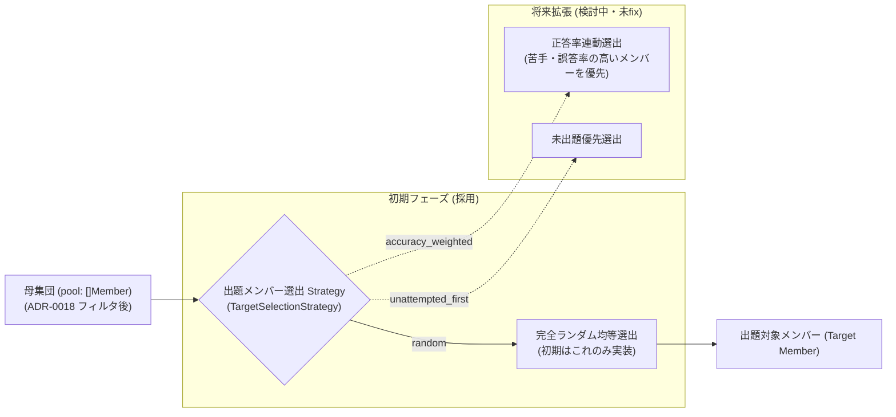

# 0020. 出題対象メンバー選出アルゴリズムにおける Strategy パターン (0020-quiz-target-member-selection-strategy.md)

- **ステータス**: 提案中 (Proposed) - ※Strategy自体は現時点ではfixせず、初期はrandomのみ採用
- **日付**: 2026-10-03

---

## 1. 背景と解決すべき課題 (Context & Problem)

クイズ出題において最も本質的な体験は、**「誰を問題として出題するか（出題対象メンバーの選出）」** です。
出題メンバーの選定には、ユーザーの習熟度やプレイ目的に応じて複数のパターンが求められます：

1. **通常・初心者プレイ**: 母集団から均等かつ重複なくランダムに出題する。
2. **復習・苦手克服プレイ**: ユーザーの過去の回答履歴を参照し、正答率が低いメンバー（間違えやすいメンバー）や、長期間解いていないメンバー（忘却曲線）を優先的に出題する。
3. **網羅・達成度プレイ**: まだ一度も解いたことがない未出題メンバーを優先して出題する。

これを出題コードの中にハードコードすると、学習アルゴリズムの調整や新ルールの追加時にコードが破綻するため、出題対象メンバーの選定ロジックを独立した Strategy として分離します。

---

## 2. 決定事項と具現化仕様 (Decision & Specification)

出題対象メンバーの選定に **Strategy パターン (`TargetSelectionStrategy`)** を採用する。
ただし、**現時点では Strategy 自体を固定（fix）せず、初期実装フェーズでは `random`（完全ランダム均等選出）のみ** を実装する。



### 具現化仕様

1. **インターフェース定義（素案）**:
   ```go
   type TargetSelectionStrategy interface {
       Name() string // "random" | "accuracy_weighted"
       SelectTarget(ctx context.Context, pool []Member, history []AnswerLog) (Member, error)
   }
   ```
2. **初期実装スコープ**:
   - `random`: 渡された母集団（`pool`）から暗号論的または擬似乱数により均等に 1 名を選出する。履歴データ（`history`）は参照しない。
3. **クイズパイプラインにおける位置づけ**:
   - **① 母集団フィルタリング ([ADR-0018](./0018-quiz-candidate-pool-filtering-architecture.md))**: グループや期生でメンバー母集団（`pool`）を抽出。
   - **② 出題メンバー選出 (本ADR)**: 母集団から「誰を問題にするか」を決定。
   - **③ 解答形式 ([ADR-0019](./0019-quiz-format-strategy-and-color-palette-architecture.md))**: 自由回答（カラーパレット）または 4 択で出題。
   - **④ 誤答ダミー選定 ([ADR-0009](./0009-quiz-generation-strategy-pattern.md))**: 4 択形式の場合のみ、誤答 3 つを決定。

---

## 3. 採否の根拠と得られる効果 (Rationale & Consequences)

- **認識と責務の明確化**:
  - 「誰を出すか（本ADR）」と「どう答えさせるか（ADR-0019）」「4択のダミーをどう作るか（ADR-0009）」の境界が完全に整理され、自由回答時にはダミー生成ロジックを完全スキップできる。
- **YAGNI 原則の遵守**:
  - 最初は `random` の 1 実装だけで動くため、複雑な重み付け計算や履歴集計を後回しにしてバックエンドの最速完成に集中できる。
