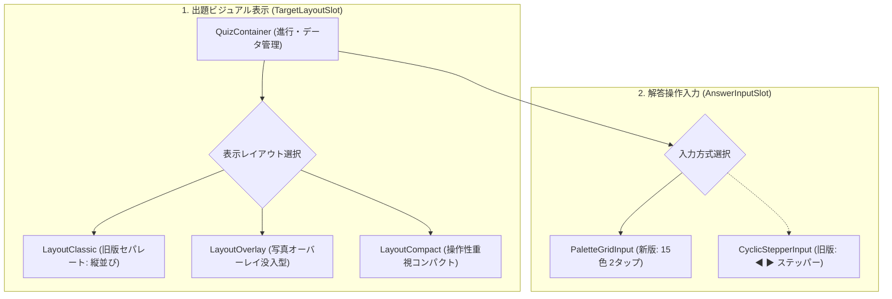

# 0022. プラガブル解答インターフェースおよび表示レイアウト共存アーキテクチャの採用 (0022-pluggable-quiz-ui-and-presentation-layout-architecture.md)

- **ステータス**: 承認 (Accepted)
- **日付**: 2026-10-04

---

## 1. 背景と解決すべき課題 (Context & Problem)

1. **AI による過剰装飾（AI Slop）の抑止と旧版ミニマルデザインの尊重**:
   - AI コーディングでは不要なネオン発光・派手なグラデーション・余計なカード枠が盛り込まれ、視覚的ノイズでファン体験が損なわれやすい。
   - 旧システムで愛用されてきた「白基調、クリーンなヘッダー、中央写真、シンプルな角丸ボタン」というミニマルで洗練された世界観を厳格に維持する必要がある。
2. **操作性と視覚レイアウトの多様性・拡張性**:
   - 解答入力には「旧版（◀ ▶ ボタンで色を順送りするペンライト風ステッパー）」と「新版（15色パレット 2タップ即判定）」が存在し、将来的に「逆引き」等の拡張も予想される。
   - また、写真のサイズ感や没入感についても、「旧版セパレート（縦並び）」だけでなく「写真下部に情報が自然に溶け込むオーバーレイ没入型」など、実機で触り比べながら最適な体験を模索できる柔軟性が求められる。
3. **フロントエンド品質保証ツールの未導入**:
   - [ADR-0013](./0013-typescript-ai-agent-driven-development-toolchain.md) で定義された TypeScript 機械的支援ツール群（Mantine, Tabler Icons, ts-pattern, Knip 等）が未導入であり、コンパイル検査・デッドコード排除の自律ループをセットアップする必要がある。

---

## 2. 決定事項と具現化仕様 (Decision & Specification)

フロントエンド画面を **「解答インターフェース（AnswerInput）」** と **「出題表示レイアウト（TargetLayout）」** の双方が独立して差し替え可能な **二重プラガブル設計（Strategy Component パターン）** として構築する。



### 具現化仕様

1. **プラガブル統一規格 (Props)**:
   ```typescript
   // 出題ビジュアルレイアウトの共通規格
   export interface TargetLayoutProps {
     target: Member;
     currentCostumeTitle: string;
     selectedLeftColor?: Color;
     selectedRightColor?: Color;
   }

   // 解答インターフェースの共通規格
   export interface AnswerInputProps {
     target: Member;
     colors: Color[];
     onAnswer: (input: { leftColorId: string; rightColorId: string }) => void;
     disabled: boolean;
   }
   ```
2. **今回実装する 3 つの表示レイアウト（比較レビュー用）**:
   - **`LayoutClassic`（旧版セパレート）**: 写真・名前・ペンライトが縦に並ぶクラシカルで安心感のある配置。
   - **`LayoutOverlay`（写真オーバーレイ没入型 ★）**: 写真を画面の約 50% まで拡大。下部の自然なフェード上に名前と光るペンライトを重ね、推し写真の迫力と余白の無駄ゼロを両立。
   - **`LayoutCompact`（コンパクト型）**: 写真サイズを抑え、パレット操作領域を広げた片手操作特化型。
3. **解答入力の実装スコープ**:
   - 今回は **`PaletteGridInput`（15色パレット 2タップ即判定）のみを実装** し、旧版ステッパー式（`CyclicStepperInput`）は将来スロットとして確保する。
4. **Mantine UI によるミニマル実装**:
   - 過剰なカスタム CSS を書かず、Mantine の標準トークン（`<Paper>`, `<Text>`, `<Button variant="outline">`, `<ActionIcon>`）を活用して清潔感を維持。
   - ダークモード切り替え（`useMantineColorScheme`）にも標準対応。
5. **フロントエンド専用ツールチェーン（[ADR-0013](./0013-typescript-ai-agent-driven-development-toolchain.md))**:
   - Next.js (`output: 'export'`), React 19, Mantine v7, Tabler Icons, ts-pattern, Knip を導入。
   - `./scripts/verify-all.sh` に `tsc --noEmit` および `knip` を組み込み、機械的自律修復ループを稼働。

---

## 3. 採否の根拠と得られる効果 (Rationale & Consequences)

- **AI Slop の撲滅**:
  - 装飾のルールが Mantine の標準トークンに縛られ、過剰なネオンやグラデーションの混入を機械的・構造的に防止できる。
- **実機検証による確信**:
  - 表示レイアウト（クラシック vs オーバーレイ vs コンパクト）をトグルで瞬時に切り替えられるため、ユーザー自身がスマホ実機で触り比べながら最高の没入感を納得して選択できる。
- **後からの旧版追加がノーリスク**:
  - プラガブルスロットに `CyclicStepperInput` を後から追加するだけで旧版を完全再現でき、既存コードの改修リスクがゼロになる。
