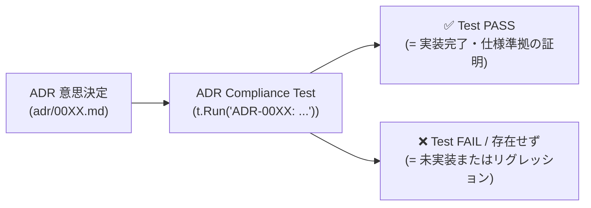

# 0028. ADR コンプライアンステスト駆動によるトレーサビリティおよび二重管理防止アーキテクチャ (0028-compliance-test-driven-adr-traceability-architecture.md)

- **ステータス**: 承認 (Accepted)
- **日付**: 2026-10-05

---

## 1. 背景と解決すべき課題 (Context & Problem)

本プロジェクトではアーキテクチャの意思決定を ADR（`adr/`）で管理し、累計 20 件以上の設計決定が蓄積されています。
しかし、開発が進むにつれて以下の課題が顕在化しました：

1. **実装状況の不透明性**: ADR 一覧（`adr/README.md`）には設計ステータス（Accepted / Proposed）しかなく、コード側でどこまで実装されているのかがコードを読まないと判別できない。
2. **手動ドキュメント管理による二重管理の破綻**: Markdown に「実装済み / 未実装」を手動記述すると、コードが修正された瞬間にドキュメントが陳腐化して嘘をつくようになる。
3. **過剰な自動化ツールの保守コスト (YAGNI 違反)**: ソースコードの AST 解析やカスタムリントを独自構築してドキュメントを自動生成する仕組みは、開発および保守のコストが過大となる。

---

## 2. 決定事項と具現化仕様 (Decision & Specification)

テストコードを **「唯一の動く仕様書（Executable Specification as Single Source of Truth）」** と位置づけ、テストの実行結果をもって ADR の実装・仕様準拠を機械的に証明する **ADR コンプライアンステスト駆動アーキテクチャ** を採用する。



### 具現化仕様

1. **テストケース命名規約**:
   - 各 ADR の要件を保護・検証するテストには、必ずテスト関数名またはサブルーチン名に `ADR-00XX` を冠する。
   - バックエンド (Go):
     ```go
     t.Run("ADR-0018: Costume (PhotoType) Filtering on Real Seed Data", func(t *testing.T) { ... })
     func TestADR0020_BlendedDeckSelection(t *testing.T) { ... }
     ```
   - フロントエンド (TypeScript / Vitest 等):
     ```ts
     describe('ADR-0007: offline image prefetch and cache', () => { ... });
     ```

2. **実装完了の客観的判定基準**:
   - 「該当 ADR の番号を冠したテストケースが存在し、CI（`make verify-ai`）で PASS していること」をもって **実装完了（Implemented）** と認定する。
   - テストが存在しない、あるいは失敗している場合は **未実装（Unimplemented）または一部実装（Partial）** とみなす。

3. **移行・整理プロセスの分離**:
   - 既存の全 ADR に対する現時点の静的な実装達成率マトリクスは、一旦 `docs/notes/08_adr_implementation_status_and_achievement_matrix.md` で一時的に可視化・整理する。
   - 各 ADR の機能実装時に、本規約に基づくコンプライアンステストを追加していくことで、自動的に静的ノートからテスト駆動の動的保証へ移行させる。

---

## 3. 採否の根拠とトレードオフ (Rationale & Trade-offs)

### 実装追跡手法の比較検討

| 方式 | 二重管理リスク | 導入・保守コスト | 信頼性・精度 | 判定 |
|---|---|---|---|---|
| **A. 静的 Markdown 手動管理** | **極めて高い**（即時陳腐化） | 低い | **低い**（人間の更新忘れで嘘になる） | **却下** |
| **B. AST 解析・独自リント生成** | ゼロ | **極めて高い**（独自ツールの保守地獄） | 高い | **却下**: YAGNI 違反 |
| **C. ADR Compliance Test [採択]** | **ゼロ**（コードが唯一の正本） | **最小限**（標準テストランナー利用） | **最高**（CI で常時自動検証） | **採用** |

- **決定打**: テストが通っていること自体が「設計通りに動き続けている」最高の証跡である。ドキュメントを更新する作業を完全撤廃でき、AI エージェントにとっても「ADR 番号を冠したテストをパスさせる」という明確なゴール（TDD）が成立する。

---

## 4. 得られる効果と今後の展望 (Consequences)

### ポジティブな影響 (Positive)
- **完全なメンテフリー**: 実装状況を更新するためのドキュメント修正作業がゼロになる。
- **リグレッションの機械的防止**: 後からの変更で過去の ADR 仕様が破壊された場合、テスト失敗として即座に検知される。
- **ワンコマンドでの状況把握**: `go test -v ./... | grep "ADR-"` 等により、現在動作保証されている ADR をターミナルから 1 秒でリストアップ可能。

### 留意点と対策 (Negative & Mitigation)
- **網羅率の段階的引き上げ**:
  - 過去の ADR すべてに初日からテストを書くのは工数がかかるため、未実装機能の実装時および既存改修時に順次コンプライアンステストを拡充する。
