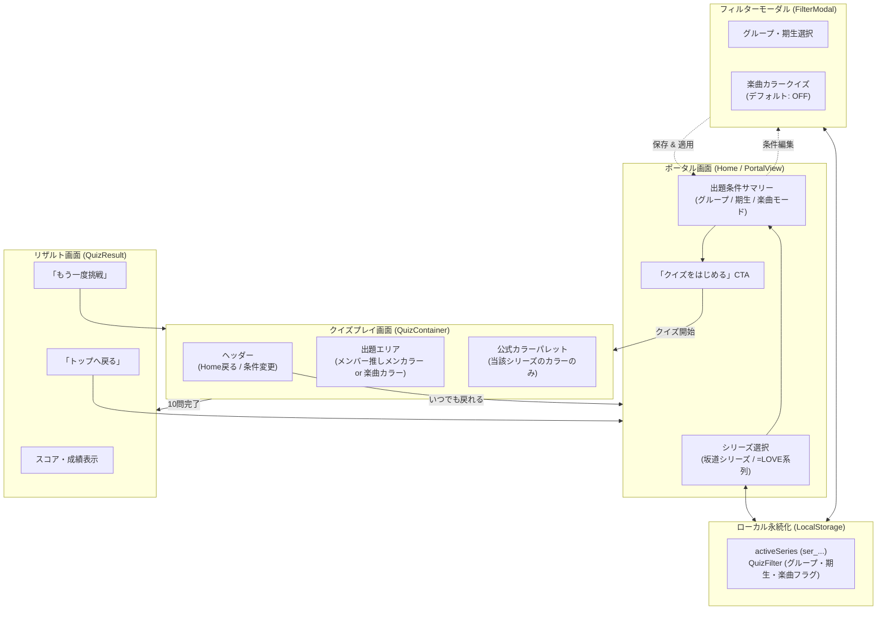

# 0028. アプリエントリーポータルおよびフィルター統合型モード選択アーキテクチャの採用 (0028-portal-and-filter-integrated-mode-architecture.md)

- **ステータス**: 承認 (Accepted)
- **日付**: 2026-10-05

---

## 1. 背景と解決すべき課題 (Context & Problem)

本システムはこれまで「URL 直アクセス = 即座に特定グループのクイズが開始する」シングルビュー構成であった。
しかし、[ADR-0026](./0026-multi-series-hierarchy-and-isolation-architecture.md)（シリーズ階層分離）および [ADR-0027](./0027-song-penlight-color-data-structure.md)（楽曲カラー）の導入に伴い、ユーザーがプレイ前に「どのシリーズ（坂道 / =LOVE系列）」の「どのクイズ（メンバー / 楽曲）」を解くかを選択するエントリーポイントが必要となった。

ここで過剰に厳格な「別ページ遷移や重厚なセッション管理機構」を新設すると、状態管理が複雑化し Local-First PWA の軽快性が損なわれる恐れがある。
そのため、既存の母集団フィルタリング（[ADR-0018](./0018-quiz-candidate-pool-filtering-architecture.md)）と自然に調和するシンプルなアーキテクチャが求められる。

---

## 2. 決定事項と具現化仕様 (Decision & Specification)

エントリーポータルを新設しつつ、モード選択をフィルター機能（`QuizFilter`）に統合する軽量アーキテクチャを正式採用する。

### 画面遷移および状態フロー

### 1. ポータル（トップ画面）によるエントリーポイント新設
- アプリ起動時にまずポータル画面（Home）を表示。
- ポータル上で「シリーズ選択（坂道シリーズ / =LOVE系列）」を行い、対象コンテキストを確定する。
- 「クイズをはじめる」アクションでクイズ画面へ遷移し、いつでもポータル（Home）へ戻れるナビゲーションを提供する。

### 2. フィルター統合型モード選択 (Filter-Integrated Mode)
- クイズモード（メンバー推しメンカラー vs 楽曲カラー）を重厚なセッション境界として物理分離せず、**出題母集団フィルター（`QuizFilter`）の条件項目として組み込む**。
- **デフォルト挙動**:
  - デフォルトは「メンバー推しメンカラークイズ（楽曲クイズはデフォルト OFF）」。
  - フィルター設定内で「楽曲カラークイズを出題する（または切り替える）」を選択可能とする。
- これにより、出題プール生成ロジック（`pkg/quiz/filter.go`）の既存パイプラインを破壊せず、単一のフィルター状態管理の中でクリーンに完結させる。

### 3. Local-First 状態永続化 ([ADR-0007](./0007-local-first-offline-pwa-architecture.md))
- 選択されたシリーズ（`activeSeries`）およびフィルター条件（グループ、期生、楽曲トグル）は LocalStorage に永続化。
- 次回アクセス時やオフライン起動時も、前回選択したシリーズと設定が即座に復元される。

---

## 3. 採否の根拠とトレードオフ (Rationale & Trade-offs)

### モード管理アプローチの比較検討

| 評価軸 | 採用案（フィルター統合型モード選択） | 代替案（厳格なセッション/ページ分離） |
|---|---|---|
| **状態管理の複雑さ** | **最小**（`QuizFilter` に1属性追加のみ） | **高**（モード別の状態ツリーやルーティングが必要） |
| **ユーザー導線** | **柔軟・軽快**（フィルターから即座に条件変更可能） | **重厚**（モード切替時に一度ポータルへ戻る必要あり） |
| **YAGNI 整合性** | **極めて高い**（必要十分なシンプル設計） | **低い**（過剰設計・オーバーエンジニアリング） |
| **Local-First親和性** | **優**（単一のフィルターオブジェクトを保存するだけ）| **普通**（複数ステートの同期が必要） |

---

## 4. 得られる効果と留意点 (Consequences)

### ポジティブな影響
- **設計の一貫性**: [ADR-0018](./0018-quiz-candidate-pool-filtering-architecture.md)（母集団フィルター）の延長線上で楽曲クイズを扱えるため、コードの重複や複雑化を最小化できる。
- **段階的リリース**: 既存のメンバークイズを一切壊すことなく、楽曲クイズ機能を安全にオン・オフできる。

### 留意点と対策
- **出題プールの最小件数チェック**: 楽曲クイズを有効化した際、選択されたグループに登録されている楽曲数が最小出題数（ADR-0018 準拠）を満たしているかをバリデーションし、不足時は UI 上で警告を表示する。
