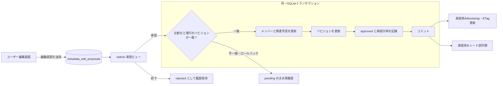

# 0037. メタデータ編集提案の保存・承認・競合管理

- **ステータス**: 承認 (Accepted)
- **日付**: 2026-10-08

## 1. 背景と解決すべき課題 (Context & Problem)

1. **未承認データの分離**:
   - ユーザーの編集案を蓄積し、管理者の承認後に公開マスタへ反映する。既存の `verified_at` は確認日時だけを表し、変更内容や承認待ち状態を保存できない。
2. **変更前後と判断履歴の保持**:
   - 対象の TypeID、変更前後の値、提出日時、承認・却下結果を保持する。提案者・承認者の記録方法は認証方式と整合させて定める。
3. **競合と重複反映の防止**:
   - 同じ対象への複数提案や、提案後のマスタ変更に対し、古い提案による上書きと同じ提案の二重反映を防ぐ。承認処理は再実行しても一度だけ反映される仕様とする。
4. **公開・逆同期の境界**:
   - Bootstrap とシード逆同期は承認済みマスタを対象とし、未承認案・却下案・判断履歴を分離する。逆同期の決定的な差分計算と再実行時の冪等性は ADR-0036、Kubernetes Job による自動化は別 ADR で扱う。

## 2. 決定事項と具現化仕様 (Decision & Specification)

1. **[DB] 提案の保存単位**:
   - `metadata_edit_proposals` に、1メンバーに対する複数項目の変更を1提案として保存する。関連写真の変更も含め、承認は提案全体を一括で行う。
2. **[Contract] 型付きの変更内容**:
   - Goモデルで編集可能項目を定義し、変更前後の値をJSONで保存する。対象はTypeIDで参照し、任意のSQLや未定義項目は受け付けない。
3. **[DB] 識別子と履歴**:
   - 提案には新しいTypeID接頭辞 `prp_` を採用する。対象メンバーID、変更内容、比較元リビジョン、状態、提出・判断日時、提案者・承認者の識別情報、却下理由を保持する。初期は認証を行わないため提案者・承認者IDを空で保存できるが、`approved_at` は必須とする。
4. **[Backend] 提出の冪等性**:
   - 再送時は同じ提案IDを使用する。同一ID・同一内容なら既存提案を返し、同一ID・異なる内容は拒否する。提出済みの変更内容は固定し、修正は新しい提案として提出する。
5. **[DB] 状態遷移**:
   - `pending → approved / rejected` とする。判断済みの提案は再編集せず、履歴として保持する。
6. **[Backend] 競合検出と承認の原子性**:
   - メンバーと関連写真をまとめたマスタのリビジョンを管理する。承認時に比較元との一致を確認し、マスタ更新・リビジョン更新・承認記録を同一トランザクションで行う。不一致なら未承認のまま再確認を求める。
7. **[Backend] 判断の冪等性**:
   - 承認済み提案への再承認は既存結果を返し、マスタを再更新しない。却下も同様とし、確定済み判断と逆の操作は拒否する。
8. **[Contract] 公開境界**:
   - Bootstrap・シード逆同期は公開マスタだけを取得する。提案と判断履歴は専用の経路で扱う。

### 提案保存から公開反映まで

## 3. 採否の根拠とトレードオフ (Rationale & Trade-offs)

| 選択肢 | 評価 |
|---|---|
| 項目別の提案テーブル | DB制約を適用しやすいが、複数項目の一括提案・承認に管理構造が増える |
| 型付きJSON＋提案テーブル | 採用。状態・対象・リビジョンはカラムで管理し、変更内容はGo型で検証する |
| 汎用JSON Patch | 任意のパス操作を許すため、編集可能範囲の制限と型検証が複雑になる |

承認単位は1メンバーと関連写真をまとめる。変更を一括反映できる一方、別項目の変更でもリビジョン不一致になるため、競合時は再確認が必要になる。

提案IDで再送を識別し、状態とリビジョンをトランザクション内で検査することで、二重反映と古い提案による上書きを防ぐ。

## 4. 得られる効果と運用規約 (Consequences & Enforcement)

1. **公開マスタの保全**:
   - 未承認・却下の編集案は、クイズ配信とシード逆同期に混入させない。
2. **再実行・同時実行の検証**:
   - 同じ提案の再送・再承認、同時承認、競合、処理途中の失敗を検証し、二重反映や部分更新が発生しないことを保証する。
3. **変更経路の統一**:
   - 承認処理とGitOpsシード同期を含むマスタ変更経路で、リビジョンを整合させる。変更がない再実行ではリビジョンを増やさない。
4. **型と仕様の同期**:
   - Goモデルを正本として関連成果物を同期し、ADR-0028に沿ったコンプライアンステストで仕様を保護する。
5. **実装前の残論点**:
   - 初期は `/admin` と管理APIを保護せず、承認日時のみを確実に記録する。提案者・承認者の認証と管理者権限の検証は、保護導入時の別ADRで定める。逆同期の冪等性はADR-0036、Kubernetes Jobは別ADRで扱う。
