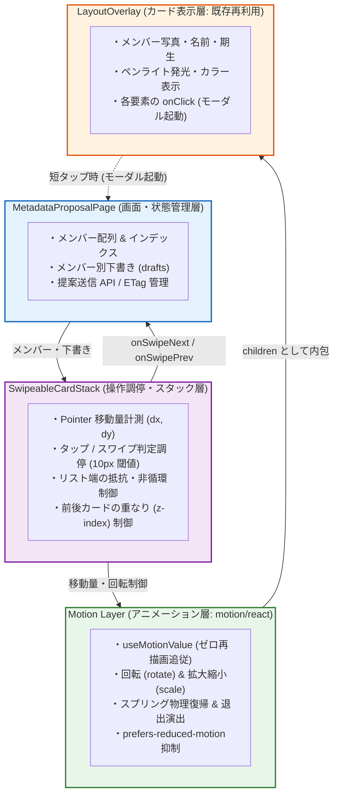

## 1. コンテキストと課題

[ADR-0037](./0037-metadata-edit-proposal-storage-and-approval.md) および [ADR-0022](./0022-pluggable-quiz-ui-and-presentation-layout-architecture.md) において、クイズ画面と同一の没入型レイアウト（`LayoutOverlay`）を踏襲したメタデータ編集画面（`/edit`）を構築した。

しかし、モバイル端末において以下の操作性・インタラクション上の課題が生じていた。

1. **連続操作のテンポ阻害**:
   - メンバーを切り替える手段が画面下部の「前へ」「次へ」ボタンに限定されており、多数のメンバーをテンポよく確認・修正する体験を損なっていた。
2. **タップ対象とジェスチャー判定の競合**:
   - カード内には「期生バッジ」「ステータスバッジ」「左右ペンライト」など重要なタップ対象要素が密集している。
   - 単純に全画面ドラッグや雑なタッチ判定を導入すると、わずかな指のブレでスワイプが誤爆したり、逆にバッジのタップが反応しなくなったりする問題があった（[note15](../docs/notes/15_member_card_swipe_interaction_design.md)）。
3. **アニメーションと状態管理の結合リスク**:
   - 指の追従やカードの傾き演出、スプリング復帰のアニメーションを React の `useState` で愚直に実装すると、高頻度な再レンダリングが発生して 60fps を維持できない。
   - 一方で既存のカード描画ロジック（`LayoutOverlay`）にドラッグ制御を埋め込むと、クイズ画面との共通化が崩壊する懸念があった。

## 2. 決定事項

メタデータ編集画面におけるメンバーカードの切り替えに Tinder 型スワイプ操作を採用し、操作調停・アニメーション・表示の責務を疎結合に分離する。

### 2.1 操作の意味と境界

- **スワイプはメンバー移動のみを担当**: カードを払う操作はメンバーの前後遷移（`next` / `prev`）のみを行い、下書きデータ（`drafts`）の破棄や提案送信などの破壊的処理は連動させない。
- **1 スワイプ = 1 メンバー**: 勢いによる複数メンバーの連続スキップを禁止し、1 回の払いで必ず 1 人だけ遷移する。
- **リスト端での抵抗と非循環**: 先頭での右スワイプ・末尾での左スワイプは、抵抗を感じる小さな移動に留めて離すと元位置へ復帰し、循環（ループ）させない。

### 2.2 タップとドラッグの厳格な調停ルール

| 操作・状態 | 判定基準 | 挙動 |
|---|---|---|
| タップ (短押下) | 移動量 dx < 10px かつ 時間 dt < 300ms | 押下された要素（期生/ステータスバッジ、ペンライト）の編集モーダルを起動 |
| スワイプ (横移動) | 水平移動 dx ≥ 10px | カード全体のドラッグへ移行。子要素のタップ発火をキャンセルし、モーダルは開かない |
| 途中キャンセル | 移動後にドラッグを中央に戻して指を離す | カードを元位置へスプリング復帰。編集モーダルは開かない |
| モーダル展開中 | ドーナツリングや確認モーダルの表示中 | カード背後のジェスチャー操作・ドラッグ判定を完全に無効化 |
| 縦スクロール干渉 | 画面上での操作 | カード領域に `touch-action: pan-y` を指定し、横方向のブラウザ履歴バック誤作動を抑止 |

### 2.3 Motion の採用とコンポーネント責務分離

アニメーション層に `motion`（旧 Framer Motion、`motion/react`）を採用し、React の再レンダリングをバイパスした `useMotionValue` によるゼロオーバーヘッド追従・スプリング物理復帰を実現する。

- **`MetadataProposalPage`**: メンバー一覧、インデックス、下書き（`drafts`）、送信状態を管理。スワイプの詳細を知らない。
- **`SwipeableCardStack`**: 手前と背後の 2 枚のカードを管理し、タップ/ドラッグの判定調停および端の抵抗を制御。
- **`Motion Layer`**: `motion.div` による追従・傾き・スプリング復帰を担当。
- **`LayoutOverlay`**: 既存の表示コンポーネント。スワイプの存在を意識せず、純粋なカード表示とタップイベントのみを担う。

## 3. 影響と評価

### メリット
- **操作性の飛躍的向上**: スマホ片手操作において、指のフリック・スワイプだけで多数のメンバーを直感的にテンポよくブラウズできる。
- **タップ誤爆の完全抑止**: 10px の移動閾値調停により、ペンライト選択やステータス編集のタップ操作感を一切損なわない。
- **高パフォーマンス**: `useMotionValue` による GPU 加速アニメーションにより、React のコンポーネントツリー再描画を伴わずに 60/120fps を維持できる。
- **既存資産の再利用**: `LayoutOverlay` に変更を加えることなく、外側をスタックコンテナで包むだけで動作するため、クイズ画面とのコード共通性を完全に保護できる。

### トレードオフ・負担
- **依存ライブラリの追加**: `motion` パッケージ（約 30KB gzipped）が追加される。ただし、React 19 に公式対応しており、手動でスプリング物理演算や割り込みアニメーションを記述・保守するコストと比較して極めて合理的である。
- **実機調整コスト**: スワイプ確定の閾値距離・フリック速度・傾き角度などの定数は、実機（iOS Safari / Android Chrome）での触感に合わせて調整する必要がある。

## 4. 検証条件と非機能要件

### 4.1 自動テスト (Playwright E2E)
- 左右スワイプ操作によるメンバーの前後切り替え。
- リスト先頭での右スワイプ・末尾での左スワイプ時の非循環復帰（先頭/末尾を超えてループしないこと）。
- スワイプ移動を繰り返しても、各メンバーの下書き編集内容（`drafts`）が消失せず維持されること。
- バッジやペンライトの短いタップで編集モーダルが正常に起動し、スワイプが誤爆しないこと。

### 4.2 実機触感検証 (iOS Safari / Android Chrome)
- ゆっくり引く、素早く払う、途中で戻す、連続して払う、復帰アニメーション中のつかみ直しが破綻なく追従すること。
- ブラウザの「戻る/進む」画面端スワイプジェスチャーと競合しないこと。

### 4.3 アクセシビリティ
- `prefers-reduced-motion`（視覚効果抑制設定）が有効な場合は、傾きや大きな退出演出を抑止し、シンプルなフェード/スライドにフォールバックする。
- スワイプ操作が困難な環境のため、画面下部の「前へ」「次へ」ボタンおよびキーボード（`ArrowLeft`, `ArrowRight`）による移動手段を常時併設する。
