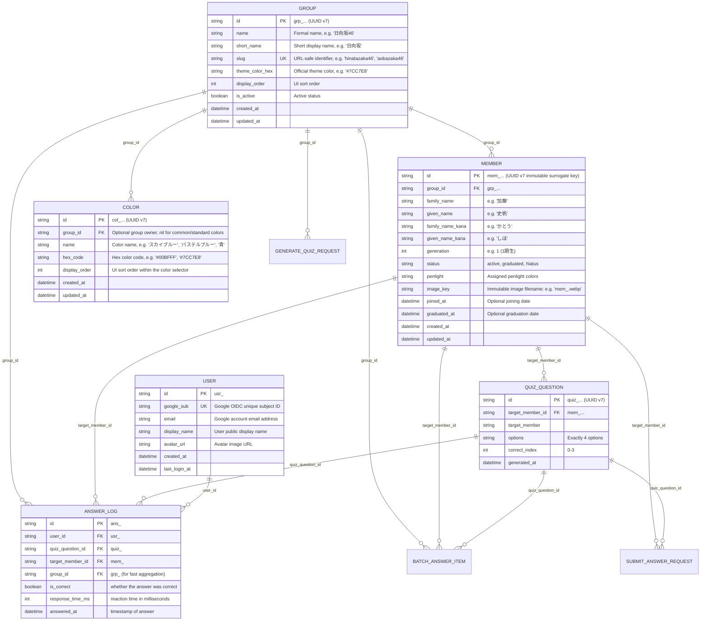

# 自動生成データモデル ER 図 (Auto-Generated Data Model)

> 本ドキュメントは `scripts/gen-er-diagram.go` が `pkg/model/*.go` の Go AST（抽象構文木）を直接静的解析して完全自動生成した資産 (Asset) です。

```mermaid
erDiagram
    USER ||--o{ ANSWER_LOG : "user_id"
    QUIZ_QUESTION ||--o{ ANSWER_LOG : "quiz_question_id"
    MEMBER ||--o{ ANSWER_LOG : "target_member_id"
    GROUP ||--o{ ANSWER_LOG : "group_id"
    GROUP ||--o{ COLOR : "group_id"
    GROUP ||--o{ GENERATE_QUIZ_REQUEST : "group_id"
    QUIZ_QUESTION ||--o{ SUBMIT_ANSWER_REQUEST : "quiz_question_id"
    MEMBER ||--o{ SUBMIT_ANSWER_REQUEST : "target_member_id"
    QUIZ_QUESTION ||--o{ BATCH_ANSWER_ITEM : "quiz_question_id"
    MEMBER ||--o{ BATCH_ANSWER_ITEM : "target_member_id"
    GROUP ||--o{ BATCH_ANSWER_ITEM : "group_id"
    GROUP ||--o{ MEMBER : "group_id"
    MEMBER ||--o{ QUIZ_QUESTION : "target_member_id"

    GROUP {
        string id PK "grp_... (UUID v7)"
        string name "Formal name, e.g. '日向坂46'"
        string short_name "Short display name, e.g. '日向坂'"
        string slug UK "URL-safe identifier, e.g. 'hinatazaka46', 'aobazaka46'"
        string theme_color_hex "Official theme color, e.g. '#7CC7E8'"
        int display_order "UI sort order"
        boolean is_active "Active status"
        datetime created_at
        datetime updated_at
    }

    COLOR {
        string id PK "col_... (UUID v7)"
        string group_id FK "Optional group owner, nil for common/standard colors"
        string name "Color name, e.g. 'スカイブルー', 'パステルブルー', '青'"
        string hex_code "Hex color code, e.g. '#00BFFF', '#7CC7E8'"
        int display_order "UI sort order within the color selector"
        datetime created_at
        datetime updated_at
    }

    MEMBER {
        string id PK "mem_... (UUID v7 immutable surrogate key)"
        string group_id FK "grp_..."
        string family_name "e.g. '加藤'"
        string given_name "e.g. '史帆'"
        string family_name_kana "e.g. 'かとう'"
        string given_name_kana "e.g. 'しほ'"
        int generation "e.g. 1 (1期生)"
        string status "active, graduated, hiatus"
        string penlight "Assigned penlight colors"
        string image_key "Immutable image filename: e.g. 'mem_<uuidv7>.webp'"
        datetime joined_at "Optional joining date"
        datetime graduated_at "Optional graduation date"
        datetime created_at
        datetime updated_at
    }

    USER {
        string id PK "usr_<uuidv7>"
        string google_sub UK "Google OIDC unique subject ID"
        string email "Google account email address"
        string display_name "User public display name"
        string avatar_url "Avatar image URL"
        datetime created_at
        datetime last_login_at
    }

    ANSWER_LOG {
        string id PK "ans_<uuidv7>"
        string user_id FK "usr_<uuidv7>"
        string quiz_question_id FK "quiz_<uuidv7>"
        string target_member_id FK "mem_<uuidv7>"
        string group_id FK "grp_<uuidv7> (for fast aggregation)"
        boolean is_correct "whether the answer was correct"
        int response_time_ms "reaction time in milliseconds"
        datetime answered_at "timestamp of answer"
    }

    QUIZ_QUESTION {
        string id PK "quiz_... (UUID v7)"
        string target_member_id FK "mem_..."
        string target_member
        string options "Exactly 4 options"
        int correct_index "0-3"
        datetime generated_at
    }

```
