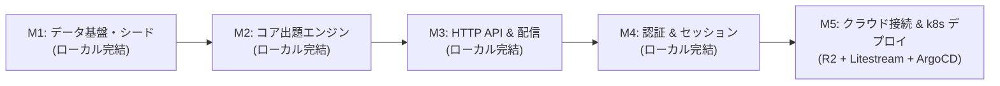

# 02. バックエンド先行完成およびクラウド連携ロードマップ

- **作成日**: 2026-10-03
- **ステータス**: 検討中・合意済み (Under Review)
- **対象**: バックエンド API サーバー構築、永続化基盤、および Cloudflare R2 / k8s 連携

---

## 1. 背景と基本方針 (Background & Policy)

1. **アプローチ B（アプリ先行型・ローカル完結開発）の採用**:
   - クラウド接続のトラブルとアプリのバグの切り分けを容易にするため、まず純粋な Go + ローカル SQLite（`./data/penlight.db`）でバックエンド API とドメインロジックを 100% 完成させる。
2. **クラウド依存の完全分離 (Zero Cloud-Vendor Lock-in)**:
   - Go バックエンド本体のコードには Cloudflare R2 や AWS S3 の SDK・認証ロジックを一切含めない（環境変数は [ADR-0015](../../adr/0015-minimal-configuration-and-secrets-management.md) の 4 つに固定）。
   - クラウドバックアップ（R2 + Litestream）は Kubernetes の Pod 構成レイヤー（サイドカー / InitContainer）で外付けする。

---

## 2. 開発マイルストーン (Milestones: M1 〜 M5)

### M1: データ基盤・シード投入 (Database Foundation)
- **目的**: データベースの自動初期化と、開発・テスト用実データの恒久化。
- **実装内容**:
  - サーバー起動時のテーブル自動マイグレーション機構。
  - 日向坂46、櫻坂46、乃木坂46のグループ、公式ペンライトカラー、主要メンバーの初期シード投入。
- **関連 ADR**: [ADR-0006](../../adr/0006-domain-schema-and-typeid-structure.md), [ADR-0017](../../adr/0017-repository-interface-and-pure-go-sqlite-architecture.md)

### M2: コア出題エンジン (Quiz Domain Logic)
- **目的**: 外部依存（DB/ネットワーク）なしで高速にクイズを生成・採点するドメイン層の完成。
- **実装内容**:
  - `pkg/quiz/`: 出題エンジン。
    - `RandomStrategy`: 完全ランダム選定（初期実装はコンテキスト維持のため `random` のみに専念し、複雑な色差計算等は将来拡張とする）。
  - グループ別・期生別絞り込みフィルター（母集団抽出）および正誤判定ロジック。
- **関連 ADR**: [ADR-0009](../../adr/0009-quiz-generation-strategy-pattern.md), [ADR-0018](../../adr/0018-quiz-candidate-pool-filtering-architecture.md)

### M3: HTTP API ＆ 不変画像配信 (HTTP API & Assets)
- **目的**: サーバープロセス起動とクライアント疎通の実現。
- **実装内容**:
  - `GET /healthz`: ヘルスチェック。
  - `GET /api/v1/bootstrap`: Local-First PWA 用マスタ一括取得（Etag / 差分更新対応）。
  - `POST /api/v1/quiz/generate`: 出題 API。
  - `POST /api/v1/quiz/answers/batch`: オフライン回答ログの一括受領・冪等保存。
  - `GET /images/{id}`: RFC 8246 不変画像配信（`Cache-Control: public, max-age=31536000, immutable`）。
  - 6大公式エラー（Problem Details）ミドルウェア。
- **関連 ADR**: [ADR-0007](../../adr/0007-local-first-offline-pwa-architecture.md), [ADR-0008](../../adr/0008-immutable-image-caching-and-zero-purge.md), [ADR-0014](../../adr/0014-error-handling-and-minimal-problem-details.md)

### M4: 認証＆セッション管理 (Auth & Session)
- **目的**: ユーザー識別と回答履歴の紐付け。
- **実装内容**:
  - Google OIDC 認証コールバックおよびユーザー自動登録。
  - HttpOnly / Secure / SameSite=Lax セッション Cookie 発行。
  - 未認証時のゲストモードフォールバック（認証情報なしでもクイズ実行可能）。
- **関連 ADR**: [ADR-0010](../../adr/0010-google-oidc-authentication-and-session-security.md), [ADR-0015](../../adr/0015-minimal-configuration-and-secrets-management.md)

### M5: クラウド接続 ＆ k8s 本番デプロイ (Cloud & GitOps Integration)
- **目的**: 本番 Kubernetes 環境への配備と、Cloudflare R2 を用いた災害対策バックアップの確立。
- **実装内容**:
  - Cloudflare R2 バケット作成と API トークン発行。
  - `deploy/litestream.yml` および k8s Secret (`litestream-r2-secret`) 配備。
  - Pod マニフェスト: InitContainer による初回復元 (`litestream restore`) + サイドカーによる秒単位差分同期 (`litestream replicate`)。
  - ArgoCD GitOps 自動デプロイと動作検証。
- **関連 ADR**: [ADR-0005](../../adr/0005-database-selection-sqlite-wal.md), [ADR-0012](../../adr/0012-kubernetes-deployment-and-gitops-architecture.md)

---

## 3. 各マイルストーンの検証基準 (Definition of Done)

| マイルストーン | 完了判定（ローカル / CI 検証） |
|---|---|
| **M1** | `sqlite.Open` 時にテーブルが自動生成され、3グループのデータが正しく引ける Go 単体テストがパスする |
| **M2** | ピュアな単体テスト（`pkg/quiz/generator_test.go`）で、ランダム選定による4択問題・正解・重複なし誤答が生成できる |
| **M3** | `go run ./cmd/server` で起動し、`curl` による `/healthz`, `/api/v1/bootstrap`, `/quiz/generate` の疎通がパスする |
| **M4** | セッション Cookie による認証状態の維持と、回答履歴の保存・取得が単体テストおよび curl で確認できる |
| **M5** | k8s クラスタ上で Pod が起動し、`penlight.db` の更新が Cloudflare R2 に秒単位で同期され、Pod 再起動時に自動復元される |
