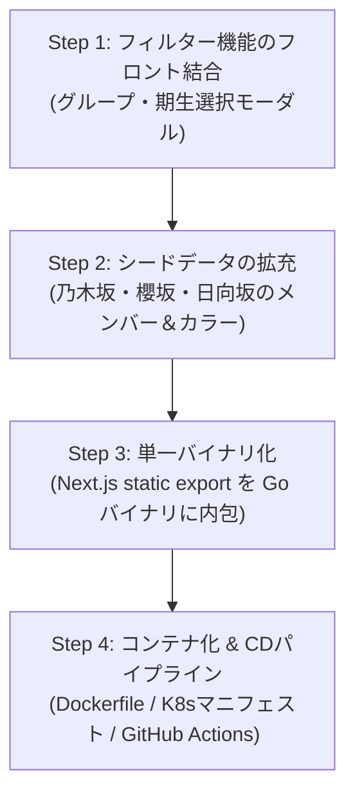

# デプロイ完了までの実装ロードマップ (Note 04)

本ノートは、推し活クイズ UI（PR #8）の検証完了後、本番デプロイ（自宅 Kubernetes 環境）を達成するために必要な残りタスクの依存関係、各ステップのスコープ、および受け入れ基準を整理した記録である。

---

## 1. 前提事項とスコープ境界

- **対象外（現段階ではスキップ）**:
  - **Cloudflare 連携**: Cloudflare Tunnel、Litestream による R2 リアルタイム同期は現時点では構築しない。
  - **Google OAuth 認証**: 認証なし（完全ゲストモード）で単一 Pod 上の SQLite により稼働する。
- **デプロイ環境**:
  - 自宅 Kubernetes（単一 Pod 構成、PersistentVolumeClaim による SQLite データベースおよび画像キャッシュの永続化）。
  - Next.js 静的出力（`output: 'export'`）を内包した Go 単一バイナリ配信。

---

## 2. 全体ロードマップ

---

## 3. ステップ別タスク定義

### Step 1: フィルター機能のフロントエンド結合
好きなグループ（日向坂46 / 櫻坂46 / 乃木坂46）や期生を絞り込んでクイズをプレイ可能にする。

- **現状**:
  - バックエンド: `pkg/quiz/filter.go` に期生・グループ・卒業生除外ロジック実装済み。
  - フロントエンド: `Header.tsx` にフィルターアイコンボタン（`IconFilter`）配置済み（モーダル未接続）。
- **作業内容**:
  1. `FilterModal.tsx` の実装（グループ選択セグメント / チップ、期生チェックボックス、全選択 / クリア機能）。
  2. クライアント側（またはクイズ開始前）での出題対象メンバー絞り込み & クイズ初期化処理の結合。
- **受け入れ基準**:
  - フィルターモーダルで「櫻坂46 2期生のみ」などを選択した際、対象メンバーのみが出題されること。
  - 絞り込み条件変更時にプログレスバーおよびスコアが正しく初期化されること。

---

### Step 2: シードデータの拡充
坂道3グループ（日向坂46・櫻坂46・乃木坂46）の現役メンバーおよび公式ペンライトカラーを揃える。

- **現状**:
  - 日向坂46の一部メンバーを中心とした最小限の検証用データのみ登録。
- **作業内容**:
  1. `seeds/data/`（`groups.json`, `members.json`, `colors.json`, `photo_types.json`）のデータ追加。
  2. `scripts/build_seed.go` を実行し、`seeds/seed.sql` および `seeds/data/image_sources.json` を再生成。
  3. ローカル DB 再起動で 3 グループのメンバー・カラーが正常にロードされることを確認。
- **受け入れ基準**:
  - 乃木坂46・櫻坂46・日向坂46の現役メンバーがシードから SQLite に正しく初期投入されること。

---

### Step 3: フロントエンドの単一バイナリ内包 (ADR-0002, ADR-0011)
Node.js や Next.js サーバーを本番に持ち込まず、Go 単一バイナリで静的アセット（HTML/JS/CSS）と API を一括配信する。

- **現状**:
  - ローカル開発では Next.js 開発サーバー（`:3000`）と Go サーバー（`:8080`）が別々に起動している。
- **作業内容**:
  1. `frontend` で `next build`（`output: 'export'`）を実行し、静的ファイル群（`frontend/out`）を出力。
  2. Go の `//go:embed` を用いて静的アセットディレクトリをバイナリに埋め込む。
  3. `pkg/server/server.go` の HTTP ルーターで SPA ルーティング（存在しないパスは `index.html` にフォールバック）を配線。
  4. `go run ./cmd/server` だけで Web アプリ全体が `:8080` で動作することを確認。
- **受け入れ基準**:
  - Node.js 非稼働状態で、Go サーバー起動のみでブラウザからクイズ画面が表示・操作できること。

---

### Step 4: コンテナ化 & CDセットアップ (Kubernetes デプロイ)
main ブランチへの push をトリガーとして自宅 Kubernetes へ自動デプロイする。

- **現状**:
  - `deploy/` マニフェストおよび Dockerfile は未整備。
- **作業内容**:
  1. **`Dockerfile`**:
     - Stage 1: `node:20-alpine` による Next.js 静的エクスポート。
     - Stage 2: `golang:1.24-alpine` による Go 単一バイナリのクロスコンパイル。
     - Stage 3: `distroless` または `alpine` による軽量・セキュアな実行コンテナイメージ作成。
  2. **Kubernetes マニフェスト** (`deploy/`):
     - `deployment.yaml`（単一レプリカ）
     - `service.yaml`
     - `pvc.yaml`（SQLite データベースおよび画像キャッシュの永続化用ボリューム）
  3. **GitHub Actions CD** (`.github/workflows/deploy.yml`):
     - main push 時に Docker イメージをビルド & GHCR へ push。
     - 自宅 Kubernetes クラスタへのローリングアップデート実行。
- **受け入れ基準**:
  - GitHub Actions でビルド・push されたコンテナが自宅 K8s 上で稼働し、アクセス可能になること。

---

## 4. 次回着手ポイント

次回セッションは **「Step 1: フィルター機能のフロントエンド結合」** から着手する。
