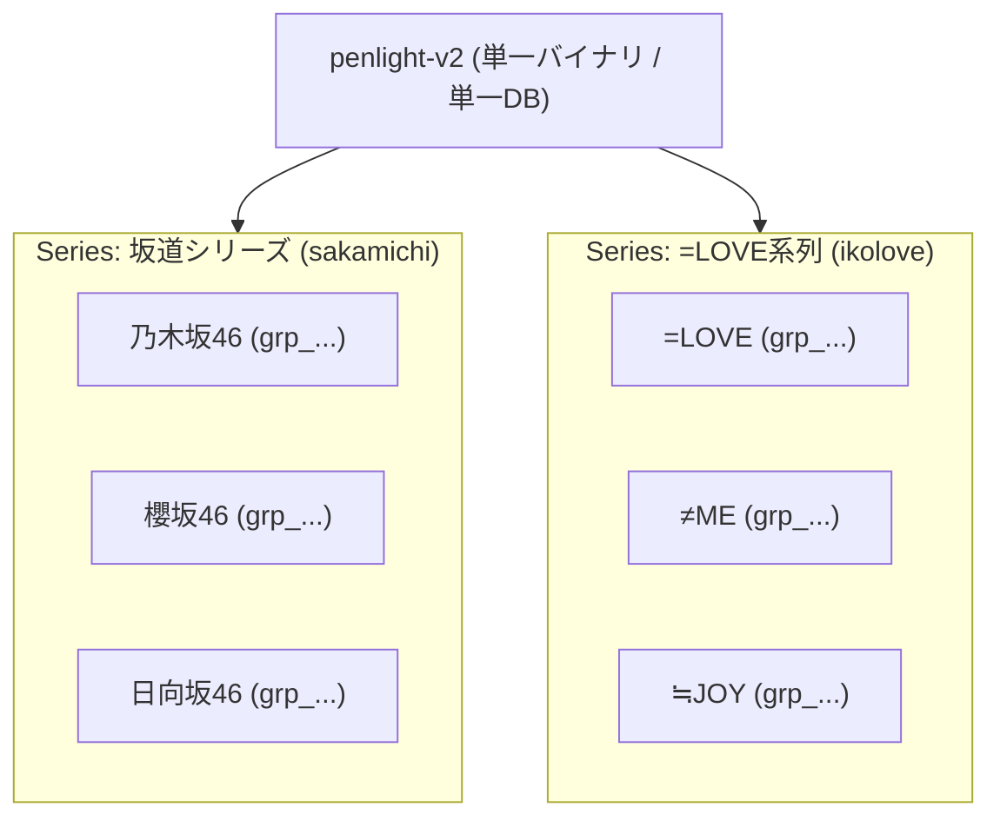

# 06. =LOVE系列導入に伴うシリーズ分離方式および楽曲カラーデータ構造拡張の設計検討

- **作成日**: 2026-10-05
- **ステータス**: 合意済み・ADR昇格準備中 (Accepted in Note)
- **対象**: =LOVE 系列（指原プロデュース）導入に伴う同一アプリ内シリーズ分離設計、および楽曲ペンライトカラー（1色/2色）データ構造の策定

---

## 1. 背景と目的

現在の penlight-v2 は坂道グループ（乃木坂46・櫻坂46・日向坂46）を対象に、単一バイナリ・動的マスタ・SQLite WAL 構成で運用されている。
今回、以下の 2 つの拡張要件を満たす設計を確定する。

1. **=LOVE 系列（=LOVE, ≠ME, ≒JOY 等）の導入**:
   - 坂道とはファン層・文脈が異なるため、クイズ出題・グループ選択・カラーパレットにおいて **「完全に混ざらない」** ことを保証する。
   - 単一バイナリ・単一 Pod（メモリ 32MiB）・単一 DB による軽量インフラ運用を維持するため、**「同一アプリ内でのシリーズ（Series）階層分離」** を採用する。
2. **楽曲（曲）ごとのペンライトカラー指定**:
   - メンバー個人の推しメンカラー（左右2本）とは別に、ライブ時の楽曲指定カラーを管理・出題可能にする。
   - 例外的な演出（虹色やセンター連動等）はサポートせず、**「左右の区別のない 1 色または 2 色（デフォルト 1 色）」** に絞った最小限のデータ構造を策定する。

---

## 2. テーマ 1: 同一アプリ内でのシリーズ（Series）分離アーキテクチャ

### 2.1 決定事項
- **アプローチ**: 同一アプリ・単一 DB 内で `Series` を第一級エンティティとして定義し、グループの上位階層として管理する。
- **インフラ方針**:
  - Kubernetes の Pod、Service、PVC、Ingress は単一構成（Recreate、メモリ 32MiB）のまま維持する。
  - 1 回のデプロイ・バージョンアップで全シリーズの機能改善が自動適用される。



### 2.2 データモデル設計 (`Series`)
TypeID: `ser_<uuidv7>`

```go
// Series represents an idol franchise or series (e.g. "坂道シリーズ", "=LOVE系列").
type Series struct {
	ID           ID        `json:"id"`            // ser_... (UUID v7)
	Name         string    `json:"name"`          // Formal name, e.g. "坂道シリーズ", "=LOVE系列"
	Slug         string    `json:"slug"`          // URL-safe identifier, e.g. "sakamichi", "ikolove"
	DisplayOrder int       `json:"display_order"` // UI sort order
	CreatedAt    time.Time `json:"created_at"`
	UpdatedAt    time.Time `json:"updated_at"`
}
```

- `Group` エンティティへの変更:
  - `SeriesID ID` (`ser_...`) を外部キーとして追加。
- 出題エンジン（`pkg/quiz/filter.go`）の境界保証:
  - 出題候補プール抽出時に `series_id` による厳格なフィルタを適用。
  - カラーパレット候補も、当該シリーズに所属するグループの公式カラーのみに制限し、パレット汚染を完全に防止する。

---

## 3. テーマ 2: 楽曲ペンライトカラー（1色/2色）のデータ構造

### 3.1 要件と割り切り仕様
1. **1 色または 2 色の指定（デフォルト 1 色）**:
   - 多くの楽曲は「会場全体で 1 色」（例: 全体白、全体青など）であり、一部の楽曲で「2 色」（例: 赤×白、黄×黄など）が指定される。
   - `Color1ID` を必須（デフォルト 1 色目）、`Color2ID` を任意（2 色指定時のみ設定）とする。
2. **左右の概念を排除 (No Left/Right Concept)**:
   - メンバーの推しメンカラーは「左手: 色A、右手: 色B」（左右の持ち方）が存在するが、楽曲カラーは「曲全体を構成する色」であり、左右の区別は存在しない。
   - クイズ判定時も、解答カラーの順序（A→B か B→A か）を問わず無順序集合として正誤判定を行う。
3. **例外演出の非サポート (YAGNI 原則)**:
   - 客席ブロック別の虹色分けや、センター推しメン連動などの例外仕様は一切持たず、スキーマを極小に保つ。
   - `description` カラムも不要とし、純粋な識別・カラー関連のみに限定する。

### 3.2 データモデル設計 (`Song`)
TypeID: `sng_<uuidv7>`

```go
// Song represents a musical track entity and its official/live penlight colors.
type Song struct {
	ID        ID        `json:"id"`          // sng_... (UUID v7)
	GroupID   ID        `json:"group_id"`    // 所属グループ (grp_...)
	Title     string    `json:"title"`       // 楽曲タイトル (例: "絶対アイドル辞めないで", "月と星が踊るMidnight")
	Kana      *string   `json:"kana"`        // 読み仮名 (任意・未設定可, ソート補助用)
	Color1ID  ID        `json:"color1_id"`   // 1色目 (必須, col_...)
	Color2ID  *ID       `json:"color2_id"`   // 2色目 (任意, col_...。1色の曲は nil)
	CreatedAt time.Time `json:"created_at"`
	UpdatedAt time.Time `json:"updated_at"`
}
```

- **判定ルール**:
  - `Color2ID == nil`: 1 色の楽曲（クイズでは 1 色を選択させる、または同色 2 本）
  - `Color2ID != nil`: 2 色の楽曲（クイズでは無順序で 2 色を選択させる）

---

## 4. ADR 起票計画

本ノートの合意内容に基づき、以下の 2 つの ADR を起票する。

- **ADR-0026**: 同一アプリ内におけるシリーズ（Series）階層分離アーキテクチャの採用
  - 分類: `ARC` / タグ: `[directory-structure, surrogate-key, extensible-group]`
- **ADR-0027**: 楽曲ペンライトカラー（1色/2色・左右なし）データ構造の採用
  - 分類: `DOM` / タグ: `[single-source-of-truth, typeid, quiz-strategy]`
