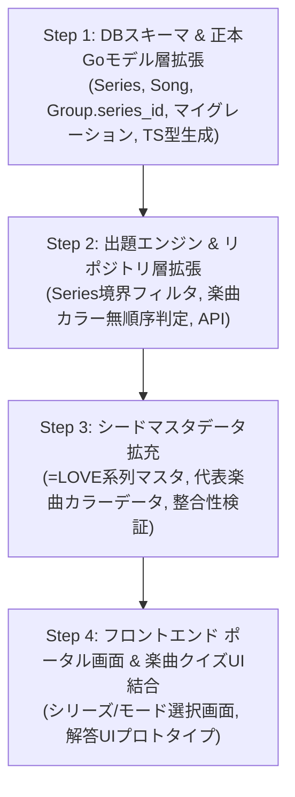

# 07. マルチシリーズ階層分離・楽曲クイズ・ポータル画面開発ロードマップ

- **作成日**: 2026-10-05
- **ステータス**: 計画ドラフト (Under Review)
- **対象**: [ADR-0026](../../adr/0026-multi-series-hierarchy-and-isolation-architecture.md), [ADR-0027](../../adr/0027-song-penlight-color-data-structure.md), [ADR-0028](../../adr/0028-portal-and-filter-integrated-mode-architecture.md), [ADR-0029](../../adr/0029-portal-layout-and-visual-identity-ui.md), [ADR-0030](../../adr/0030-generic-quiz-engine-and-target-abstraction.md) の具現化、トップ画面新設、およびジェネリック出題抽象化

---

## 1. 目的とスコープ境界

### 目的
[ADR-0026](../../adr/0026-multi-series-hierarchy-and-isolation-architecture.md)（同一アプリ内シリーズ分離）、[ADR-0027](../../adr/0027-song-penlight-color-data-structure.md)（楽曲カラーデータ構造）、[ADR-0028](../../adr/0028-portal-and-filter-integrated-mode-architecture.md)（ポータル新設 & フィルター統合型モード選択）、[ADR-0029](../../adr/0029-portal-layout-and-visual-identity-ui.md)（ビジュアルアイデンティティ重視ポータルUI）、および [ADR-0030](../../adr/0030-generic-quiz-engine-and-target-abstraction.md)（ジェネリック出題・判定エンジン抽象化）に基づき、単一バイナリ・軽量運用（メモリ 32MiB）を維持したまま、以下の機能安全な段階的リリースを達成する。

### スコープ境界
- **対象シリーズ**:
  - `sakamichi`: 乃木坂46・櫻坂46・日向坂46（既存）
  - `ikolove`: =LOVE・≠ME・≒JOY（新規）
- **クイズモード**:
  - **完全分離**: 「メンバー推しメンカラー当て」と「楽曲カラー当て」は混在させず、独立したモードとして提供。
- **UI / エントリーポイント**:
  - **トップ画面（ポータル画面）の新設**: シリーズ選択およびクイズモード選択を最初に行う。
- **楽曲カラー仕様**:
  - 1 色または 2 色（左右なし、例外演出なし、Kana は Optional）。

---

## 2. 全体ロードマップ (Milestones)

手戻りを防ぎ、各ステップで確実に `make verify-ai` をパスさせる 4 段階の PR 分割計画。



---

## 3. ステップ別タスク定義と受け入れ基準

### Step 1: DBスキーマ & 正本Goモデル層拡張
- **作業内容**:
  1. `pkg/model/series.go` の新設（TypeID: `ser_<uuidv7>`）
  2. `pkg/model/song.go` の新設（TypeID: `sng_<uuidv7>`）
  3. `pkg/model/group.go` に `SeriesID ID` (`ser_...`) を追加
  4. `migrations/000002_add_series_and_songs.up.sql` の作成（SQLite DDL）
  5. `./scripts/generate-all.sh` による TS 型（`frontend/src/types/generated.ts`）および ER 図（`assets/schema/`）の自動再生成
- **受け入れ基準**:
  - `make verify-ai` を 1 行でパスすること（型不整合・typos なし）。

---

### Step 2: 出題エンジン & リポジトリ層拡張 ([ADR-0030](../../adr/0030-generic-quiz-engine-and-target-abstraction.md))
- **作業内容**:
  1. `pkg/model/repository.go` に `SeriesRepository`, `SongRepository` メソッドを追加
  2. `pkg/repository/sqlite.go` にクエリ実装
  3. `pkg/quiz/target.go` に `QuizTarget` インターフェース（`GetID()`, `GetCorrectColors()`）を新設
  4. `Member` および `Song` に `QuizTarget` インターフェースを実装
  5. `pkg/quiz/deck.go` の `BuildBlendedDeck` をジェネリック化（`BuildBlendedDeck[T QuizTarget]`）
  6. `pkg/quiz/judge.go` の `JudgeAnswer` を無順序カラー集合一致判定に共通化
  7. `pkg/quiz/filter.go` にシリーズ境界フィルタ（他シリーズのグループ・カラー混入遮断）を実装
  8. 単体テストの作成・拡充（`pkg/quiz/`）
- **受け入れ基準**:
  - メンバーと楽曲の両方が同一の `BuildBlendedDeck` で正しくシャッフル・出題されること。
  - 1色（楽曲）および2色（メンバー・楽曲）の無順序判定が単体テストで網羅されていること。
  - 坂道シリーズ指定時に =LOVE 系列のデータが絶対に混入しないテストがパスすること。

---

### Step 3: シードマスタデータ拡充
- **作業内容**:
  1. `seeds/data/series.json` 新設（`sakamichi`, `ikolove`）
  2. `seeds/data/groups.json` 更新（既存グループへの `series_id` 紐付け、=LOVE・≠ME・≒JOY 追加）
  3. `seeds/data/colors.json` 更新（=LOVE 系列公式カラーの追加）
  4. `seeds/data/songs.json` 新設（各グループの代表曲およびカラー指定）
  5. `scripts/build_seed.go` の拡張と `seeds/seed.sql` 再生成
  6. `scripts/verify_master.go` の検証拡張
- **受け入れ基準**:
  - `make verify-ai` でマスタ整合性検証（104 メンバー + 新規データ）をすべてクリアすること。

---

### Step 4: フロントエンド ポータル画面 & 楽曲クイズUI結合
- **作業内容**:
  1. トップ画面（ポータル画面: `PortalView.tsx`）の新設
     - シリーズ選択（「坂道シリーズ」 / 「=LOVE系列」）
     - モード選択（「メンバーカラークイズ」 / 「楽曲カラークイズ」）
  2. 楽曲クイズ解答 UI の具体化（1色/2色選択のインタラクション決定）
  3. `Header.tsx` および `FilterModal.tsx` のシリーズ連動
  4. オフライン（Local-First）動作の確認
- **画面遷移および状態フロー**:
  ```mermaid
  flowchart TD
      subgraph Portal["ポータル画面 (Home / PortalView)"]
          SeriesSelect["シリーズ選択<br/>(坂道シリーズ / =LOVE系列)"]
          FilterSummary["出題条件サマリー<br/>(グループ / 期生 / 楽曲モード)"]
          StartBtn["「クイズをはじめる」CTA"]

          SeriesSelect --> FilterSummary
          FilterSummary --> StartBtn
      end

      subgraph Modal["フィルターモーダル (FilterModal)"]
          GroupGen["グループ・期生選択"]
          SongToggle["楽曲カラークイズ<br/>(デフォルト: OFF)"]
      end

      subgraph Quiz["クイズプレイ画面 (QuizContainer)"]
          HeaderNav["ヘッダー<br/>(Home戻る / 条件変更)"]
          QuizArea["出題エリア<br/>(メンバー推しメンカラー or 楽曲カラー)"]
          Palette["公式カラーパレット<br/>(当該シリーズのカラーのみ)"]
      end

      subgraph Result["リザルト画面 (QuizResult)"]
          Score["スコア・成績表示"]
          RetryBtn["「もう一度挑戦」"]
          HomeBtn["「トップへ戻る」"]
      end

      subgraph Storage["ローカル永続化 (LocalStorage)"]
          State["activeSeries (ser_...)<br/>QuizFilter (グループ・期生・楽曲フラグ)"]
      end

      FilterSummary -.->|"条件編集"| Modal
      Modal -.->|"保存 & 適用"| FilterSummary
      StartBtn -->|"クイズ開始"| Quiz
      Quiz -->|"10問完了"| Result
      HeaderNav -->|"いつでも戻れる"| Portal
      HomeBtn --> Portal
      RetryBtn --> Quiz

      SeriesSelect <--> Storage
      Modal <--> Storage
  ```
- **受け入れ基準**:
  - トップ画面から直感的にシリーズ・モードを選んでクイズを開始できること。
  - シリーズ間の完全分離が UI 上で担保されていること。
