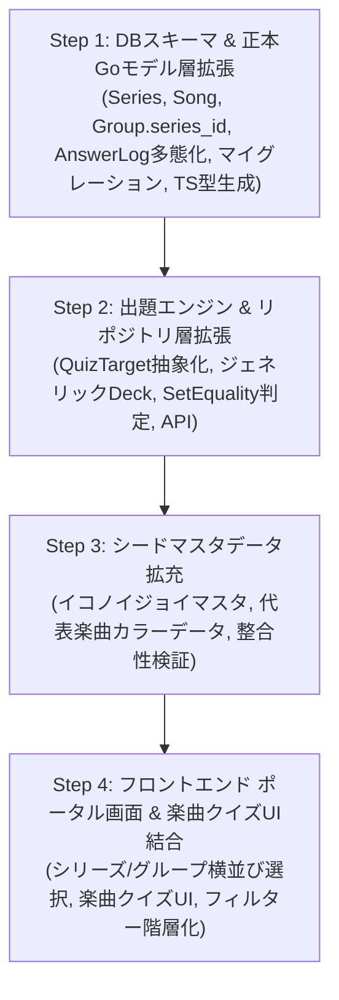

# 09. マルチシリーズ階層分離・楽曲クイズ・ポータル画面開発ロードマップ

- **作成日**: 2026-10-05
- **ステータス**: 全ステップ完了 / Merged (Step 1〜4)
- **対象**: [ADR-0026](../../adr/0026-multi-series-hierarchy-and-isolation-architecture.md), [ADR-0027](../../adr/0027-song-penlight-color-data-structure.md), [ADR-0029](../../adr/0029-portal-and-filter-integrated-mode-architecture.md), [ADR-0030](../../adr/0030-portal-layout-and-visual-identity-ui.md), [ADR-0031](../../adr/0031-generic-quiz-engine-and-target-abstraction.md), [ADR-0032](../../adr/0032-answer-log-multi-target-polymorphism-architecture.md) の具現化、トップ画面新設、およびジェネリック出題抽象化

---

## 0. 進捗状況と完了サマリー (Progress & Summary)

### 進捗マトリクス (Progress Matrix)
| ステップ | 内容 | トピックブランチ | ステータス | 成果物 / PR |
|---|---|---|---|---|
| **Step 1** | DBスキーマ & 正本Goモデル層拡張 | `feat/step1-db-schema-and-models` | 🟣 **Merged** | [PR #23](https://github.com/AobaIwaki123/penlight-v2/pull/23) |
| **Step 2** | 出題エンジン & リポジトリ層拡張 | `feat/step2-quiz-engine-generics-and-repo` | 🟣 **Merged** | [PR #24](https://github.com/AobaIwaki123/penlight-v2/pull/24) |
| **Step 3** | シードマスタデータ拡充 | `feat/step3-seed-data-and-verify` | 🟣 **Merged** | [PR #26](https://github.com/AobaIwaki123/penlight-v2/pull/26) |
| **Step 4** | ポータル画面 & 楽曲クイズUI結合 | `feat/step4-portal-and-song-quiz-ui` | 🟣 **Merged** | [PR #27](https://github.com/AobaIwaki123/penlight-v2/pull/27) |

### 開発完了サマリー (Summary)
全 4 ステップのPRがすべて承認・マージ完了。
同一アプリ内での「シリーズ階層分離（坂道シリーズ / イコノイジョイ）」、「楽曲ペンライトカラークイズ」、「ポータル画面新設」が単一バイナリ・軽量設計（メモリ 32MiB）を維持したまま完全に結合・稼働。

---

## 1. 目的とスコープ境界

### 目的
[ADR-0026](../../adr/0026-multi-series-hierarchy-and-isolation-architecture.md)（同一アプリ内シリーズ分離）、[ADR-0027](../../adr/0027-song-penlight-color-data-structure.md)（楽曲カラーデータ構造）、[ADR-0029](../../adr/0029-portal-and-filter-integrated-mode-architecture.md)（ポータル新設 & フィルター統合型モード選択）、[ADR-0030](../../adr/0030-portal-layout-and-visual-identity-ui.md)（ビジュアルアイデンティティ重視ポータルUI）、[ADR-0031](../../adr/0031-generic-quiz-engine-and-target-abstraction.md)（ジェネリック出題・判定エンジン抽象化）、および [ADR-0032](../../adr/0032-answer-log-multi-target-polymorphism-architecture.md)（回答ログ多態性永続化）に基づき、単一バイナリ・軽量運用（メモリ 32MiB）を維持したまま、以下の機能安全な段階的リリースを達成する。

### スコープ境界
- **対象シリーズ**:
  - `sakamichi`: 乃木坂46・櫻坂46・日向坂46（既存）
  - `ikolove`: =LOVE・≠ME・≒JOY（新規）
- **クイズモード**:
- **対象シリーズ**:
  - `sakamichi`: 乃木坂46・櫻坂46・日向坂46（既存）
  - `ikolove`: =LOVE・≠ME・≒JOY（新規、呼称: 「イコノイジョイ」）
- **クイズモード**:
  - **完全分離**: 「メンバー推しメンカラー当て」と「楽曲カラー当て」は混在させず、独立したモードとして提供。
- **UI / エントリーポイント**:
  - **トップ画面（ポータル画面）の新設**: シリーズ選択（「坂道シリーズ」 / 「イコノイジョイ」）および配下グループの横並び選択、クイズモード選択を行う。
- **楽曲カラー仕様**:
  - 1 色または 2 色（左右なし、例外演出なし、Kana は Optional）。

### 作業環境・引き継ぎ情報 (Workspace)
- **作業ディレクトリ**: `/Users/aobaiwaki/penlight-v2`
- **ベースブランチ**: `origin/main`
- **トピックブランチ命名規則**:
  - Step 1: `feat/step1-db-schema-and-models` (Merged)
  - Step 2: `feat/step2-quiz-engine-generics-and-repo` (Merged)
  - Step 3: `feat/step3-seed-data-and-verify` (Merged)
  - Step 4: `feat/step4-portal-and-song-quiz-ui` (Merged)
- **検証コマンド**: `make verify-ai`（トークン節約モード）または `make verify`（詳細ログ）

---

## 2. 全体ロードマップ (Milestones)

手戻りを防ぎ、各ステップで確実に `make verify-ai` をパスさせる 4 段階の PR 分割計画（全完了）。



---

## 3. ステップ別タスク定義と受け入れ基準

### Step 1: DBスキーマ & 正本Goモデル層拡張 ([ADR-0026](../../adr/0026-multi-series-hierarchy-and-isolation-architecture.md), [ADR-0027](../../adr/0027-song-penlight-color-data-structure.md), [ADR-0032](../../adr/0032-answer-log-multi-target-polymorphism-architecture.md))
- **作業内容**:
  1. `pkg/model/series.go` の新設（TypeID: `ser_<uuidv7>`）
  2. `pkg/model/song.go` の新設（TypeID: `sng_<uuidv7>`）
  3. `pkg/model/group.go` に `SeriesID ID` (`ser_...`) を追加
  4. `pkg/model/answer.go` の改修（`TargetMemberID *ID`, `TargetSongID *ID` への多態化、ADR-0032）
  5. `migrations/000002_add_series_and_songs.up.sql` の作成（SQLite DDL: Series, Song, answer_logs改修）
  6. `./scripts/generate-all.sh` による TS 型（`frontend/src/types/generated.ts`）および ER 図（`assets/schema/`）の自動再生成
- **受け入れ基準**:
  - `make verify-ai` を 1 行でパスすること（型不整合・typos なし）。

---

### Step 2: 出題エンジン & リポジトリ層拡張 ([ADR-0031](../../adr/0031-generic-quiz-engine-and-target-abstraction.md))
- **作業内容**:
  1. `pkg/model/repository.go` に `SeriesRepository`, `SongRepository` メソッドを追加
  2. `pkg/repository/sqlite.go` にクエリ実装
  3. `pkg/quiz/target.go` に `QuizTarget` インターフェース（`GetID()`, `GetCorrectColors()`）を新設
  4. `Member` および `Song` に `QuizTarget` インターフェースを実装
  5. `pkg/quiz/deck.go` の `BuildBlendedDeck` をジェネリック化（`BuildBlendedDeck[T QuizTarget]`）
  6. `pkg/quiz/judge.go` の `JudgeAnswer` を無順序カラー集合一致判定に共通化
  7. `pkg/quiz/filter.go` にシリーズ境界フィルタ（他シリーズのグループ・カラー混入遮断）を実装
  8. 単体テストの作成・拡充（`pkg/quiz/`）
- **受け入れ基準**:
  - メンバーと楽曲の両方が同一の `BuildBlendedDeck` で正しくシャッフル・出題されること。
  - 1色（楽曲）および2色（メンバー・楽曲）の無順序判定が単体テストで網羅されていること。
  - 坂道シリーズ指定時にイコノイジョイのデータが絶対に混入しないテストがパスすること。

---

### Step 3: シードマスタデータ拡充
- **作業内容**:
  1. `seeds/data/series.json` 新設（`sakamichi`, `ikolove` - 「イコノイジョイ」）
  2. `seeds/data/groups.json` 更新（既存グループへの `series_id` 紐付け、=LOVE・≠ME・≒JOY 追加）
  3. `seeds/data/colors.json` 更新（イコノイジョイ公式カラーの追加）
  4. `seeds/data/songs.json` 新設（各グループの代表曲およびカラー指定）
  5. `scripts/build_seed.go` の拡張と `seeds/seed.sql` 再生成
  6. `scripts/verify_master.go` の検証拡張
- **受け入れ基準**:
  - `make verify-ai` でマスタ整合性検証（104 メンバー + 新規データ）をすべてクリアすること。

---

### Step 4: フロントエンド ポータル画面 & 楽曲クイズUI結合 ([ADR-0029](../../adr/0029-portal-and-filter-integrated-mode-architecture.md), [ADR-0030](../../adr/0030-portal-layout-and-visual-identity-ui.md))
- **対象ファイル**:
  - `frontend/src/features/portal/components/PortalView.tsx` (新設: シリーズ選択・配下グループ横並びカード・モード切替・CTA)
  - `frontend/src/features/quiz/components/Header.tsx` (グループ名表示・ポータル戻るナビゲーション)
  - `frontend/src/features/quiz/components/FilterModal.tsx` (シリーズ連動グループ/期生選択 & 楽曲モードトグル)
  - `frontend/src/features/quiz/components/QuizContainer.tsx` (ポータルとクイズ画面の連携・楽曲クイズモード対応)
  - `frontend/src/features/quiz/components/SongQuizArea.tsx` (新設: 楽曲タイトル・Kana・1色/2色解答パレット)
- **UI/UX 設計決定事項 (User Feedback)**:
  1. **シリーズ呼称**: 「=LOVE系列」ではなく、公式・合同総称である **「イコノイジョイ」** に統一。
  2. **ポータル画面（トップページ）**:
     - 上段に **シリーズ選択（SegmentedControl: 坂道シリーズ / イコノイジョイ）**。
     - 下段に **選択されたシリーズ配下のグループを横並び（SimpleGrid）で配置**（将来ロゴ差し替え可能なカードUI）。
     - バージョン表記や期生・卒業生等の複雑なフィルターはトップページには置かず、極限までシンプルに保つ。
  3. **フィルターモーダル（クイズ画面内）**:
     - 将来の拡張性を重視し、**「シリーズ選択 → 配下のグループ選択」** の階層方式を維持。
     - テーマカラーの丸印は排除し、文字のみの SegmentedControl で表示。
  4. **クイズ画面ヘッダー左上**:
     - 冗長なシリーズ名は非表示とし、**グループ名のみ**（+ 楽曲モード時のバッジ）を表示。
- **作業チェックリスト**:
  1. [x] ポータル画面コンポーネント（`PortalView.tsx`）の新設
  2. [x] フィルターモーダル（`FilterModal.tsx`）のシリーズ連動・文字のみSegmentedControl化
  3. [x] 楽曲クイズ解答 UI の具体化（`SongQuizArea.tsx`）
  4. [x] ヘッダーナビゲーションの改善（`Header.tsx`、グループ名のみ表示、Home戻るボタン）
  5. [x] 1色/2色楽曲判定およびUIの最適化
- **画面遷移および状態フロー**:
  ```mermaid
  flowchart TD
      subgraph Portal["ポータル画面 (Home / PortalView)"]
          SeriesSelect["シリーズ選択<br/>(坂道シリーズ / イコノイジョイ)"]
          GroupSelect["配下グループ選択<br/>(横並びカード)"]
          ModeSelect["クイズ形式選択<br/>(メンバー / 楽曲)"]
          StartBtn["「クイズをはじめる」CTA"]

          SeriesSelect --> GroupSelect
          GroupSelect --> ModeSelect
          ModeSelect --> StartBtn
      end

      subgraph Modal["フィルターモーダル (FilterModal)"]
          ModalSeries["シリーズ選択 (文字のみ)"]
          ModalGroup["配下グループ選択 (文字のみ)"]
          ModalGens["期生・卒業生選択"]
          ModalSongToggle["クイズ形式 (メンバー / 楽曲)"]

          ModalSeries --> ModalGroup
          ModalGroup --> ModalGens
          ModalGroup --> ModalSongToggle
      end

      subgraph Quiz["クイズプレイ画面 (QuizContainer)"]
          HeaderNav["ヘッダー<br/>(Home戻る / グループ名表示 / フィルター起動)"]
          QuizArea["出題エリア<br/>(メンバー推しメンカラー or 楽曲カラー)"]
          Palette["公式カラーパレット<br/>(当該シリーズのカラーのみ)"]
      end

      subgraph Result["リザルト画面 (Modal)"]
          Score["スコア・成績表示"]
          RetryBtn["「もう一度挑戦」"]
          HomeBtn["「トップへ戻る」"]
      end

      subgraph Storage["ローカル永続化 (LocalStorage)"]
          State["savedSettings<br/>(groupId, songMode)"]
      end

      StartBtn -->|"クイズ開始"| Quiz
      HeaderNav -.->|"フィルターモーダル開く"| Modal
      Modal -.->|"保存 & 即時再出題"| Quiz
      Quiz -->|"全問完了"| Result
      HeaderNav -->|"いつでも戻れる"| Portal
      HomeBtn --> Portal
      RetryBtn --> Quiz

      Portal <--> Storage
      Modal <--> Storage
  ```
- **受け入れ基準**:
  - トップ画面から直感的にシリーズ・グループ・モードを選んでクイズを開始できること。
  - シリーズ間の完全分離が UI 上で担保されていること（坂道選択時にイコノイジョイのカラーや楽曲が表示されない）。
  - クイズ画面ヘッダー左上はグループ名のみでスッキリと表示されること。
  - `make verify-ai` を 1 行でパスすること。
