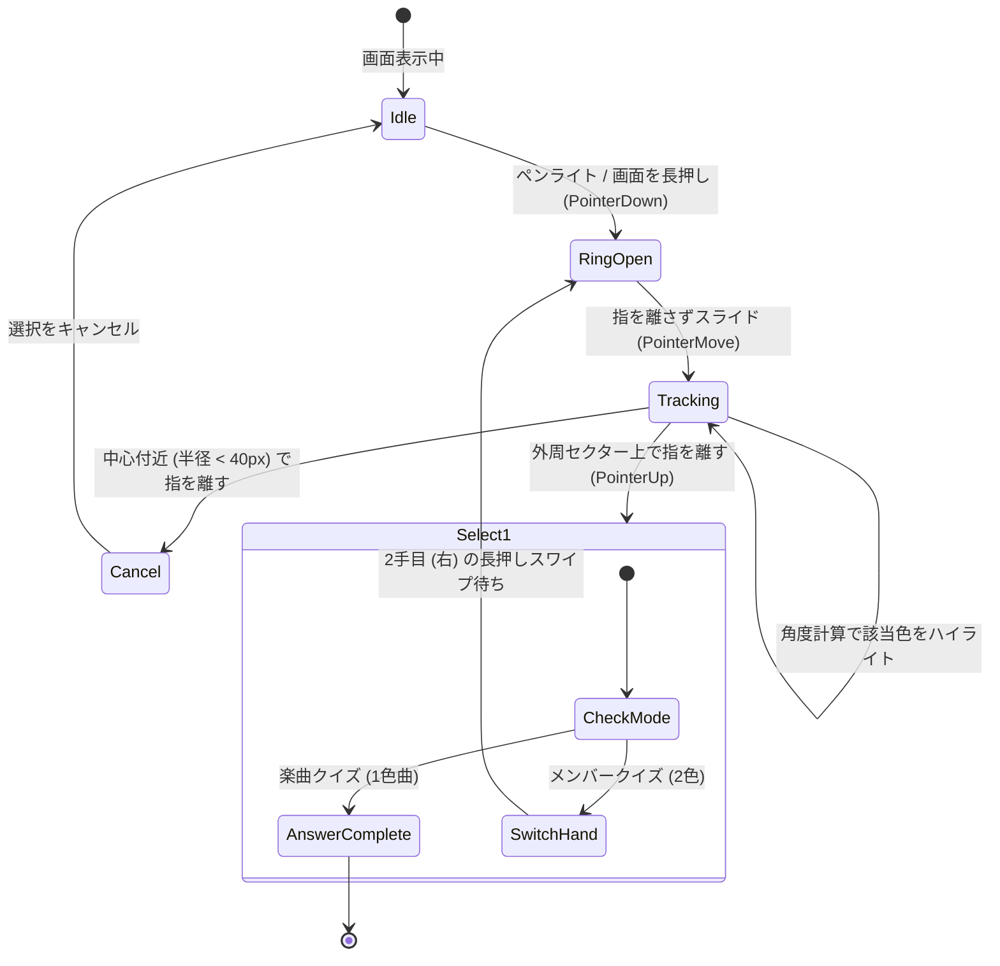

# 12. 長押しスワイプ（Press & Drag）ジェスチャーによる直感的選択UI設計検討

- **作成日**: 2026-10-05
- **ステータス**: 検討中・プロトタイプ構想 (Proposed in Note)
- **対象**: ドーナツリングカラーパレットおよび各種選択系UIのジェスチャー操作化

---

## 1. 背景と目的

現在の penlight-v2 では、カラーパレット（ドーナツリング）や各種選択肢は「タップ（Click）」を前提として実装されている。
具体的には以下のステップが必要である。

```
【現状のタップ方式】
1. ペンライトや画面をタップしてモーダルを開く
2. リング上の色をタップして選択する
3. （2色目の色をタップして選択する）
4. モーダルが閉じて解答完了
```

これに対し、ユーザーより **「タップではなく長押しスワイプで動かせるようにすると、より直感的になるのでは」** というアイデアが提案された。
本ノートでは、この長押しスワイプ（Press & Drag / Radial Gesture）の操作感、技術的実現可能性、実装難度、および段階的導入計画を整理・記録する。

---

## 2. 実装難易度の客観的評価

| 対象 | 実装難易度 | 工数目安 | 依存関係 | 主な理由・課題 |
|---|---|---|---|---|
| **A. ドーナツリング限定** | **中** | 1〜2日 | Web標準（PointerEvents） | 円形配置のため中心からの角度計算（`Math.atan2`）が極めてシンプル。モーダル内のため背面スクロールとの競合もない。 |
| **B. 画面全体の全選択系** | **高** | 1週間以上 | Mantineラップ / カスタム | Mantine標準コンポーネント（SegmentedControl等）がタップ前提。ポータル画面全体の縦スクロールとスワイプ判定が衝突しやすい。 |

**結論方針**:
まずは費用対効果と体験向上が最も大きい **「A. ドーナツリング限定」** で先行プロトタイピングを行い、実機での操作感を検証してから全体適用を判断する。

---

## 3. ドーナツリングにおける長押しスワイプ仕様案

### 3.1 インタラクションフロー (1アクション完結)



### 3.2 幾何学的な判定ロジック (Radial Math)

- **中心座標**: ドーナツリングの中心 $(c_x, c_y)$
- **現在指座標**: $(p_x, p_y)$
- **差分ベクトル**: $dx = p_x - c_x, \quad dy = p_y - c_y$
- **中心からの距離**: $r = \sqrt{dx^2 + dy^2}$
- **角度計算**: $\theta = \text{atan2}(dy, dx) \quad (-\pi \le \theta \le \pi)$

```typescript
// 1. デッドゾーン判定 (誤タップ・キャンセル)
if (r < 40) {
  // キャンセル領域: 色のハイライトを解除
  setHoveredColor(null);
  return;
}

// 2. 角度の正規化 (0 〜 2π、真上を 0 度とする)
const normalizedAngle = (Math.atan2(dy, dx) + Math.PI / 2 + 2 * Math.PI) % (2 * Math.PI);

// 3. セクターインデックスの特定
const sectorSize = (2 * Math.PI) / colors.length;
const selectedIndex = Math.floor(normalizedAngle / sectorSize) % colors.length;
const targetColor = colors[selectedIndex];
```

### 3.3 2色選択（メンバークイズ）の操作フロー

スマホの片手親指操作を考慮した場合、以下の **2連続スワイプ方式** が最も自然である。

1. **1色目**: 長押しスワイプ → 目的の色の上で指を離す（左手カラー確定・自動で右手へフォーカス移行）
2. **2色目**: もう一度長押しスワイプ → 目的の色の上で指を離す（右手カラー確定・即座に解答提出）

※ 楽曲クイズ（1色指定曲）の場合は、1回のスワイプ＆リリースで即座に解答完了となる。

### 3.4 モバイル特有の考慮事項

1. **スクロール抑止**:
   - スワイプ判定領域には CSS `touch-action: none;` を指定し、ブラウザのスクロールやピンチズーム誤爆を防止。
2. **ハプティックフィードバック (振動)**:
   - スワイプ中に色が切り替わった瞬間に `navigator.vibrate(10)` を呼ぶことで、カチカチとダイヤルを回すような心地よい触覚フィードバックを提供可能。
3. **タップ操作との後方互換性**:
   - スワイプせずに「色を直接タップ」する従来の操作もそのまま残し、両対応とする。

---

## 4. プロトタイプ実装ステップ（着手時）

1. **Step 1: ドーナツリングへの PointerEvents 結合**:
   - `DonutRingModal.tsx` に `onPointerDown`, `onPointerMove`, `onPointerUp` を追加。
   - 角度計算によるリアルタイムホバー色連動を検証。
2. **Step 2: リリース確定とデッドゾーン実装**:
   - 指を離したときの位置に応じた色決定・キャンセルの挙動を調整。
3. **Step 3: 実機検証（iOS Safari / Android Chrome）**:
   - スクロール抑止やジェスチャーの引っかかりがないかを検証。
