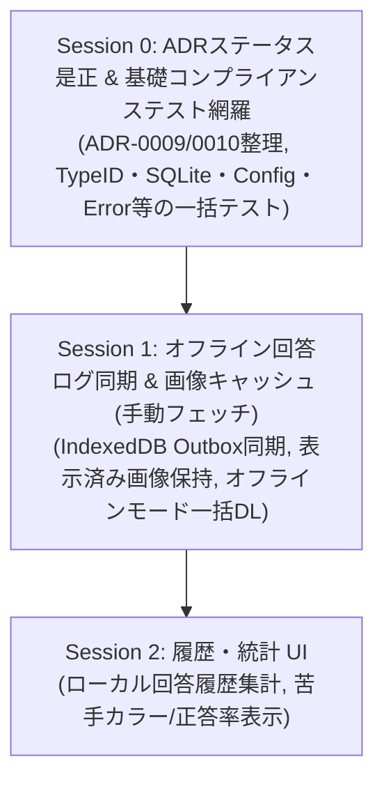

# 13. ADR ギャップ解消およびセッション分割ロードマップ

- **ステータス**: 合意済みロードマップ (Accepted Roadmap)
- **日付**: 2026-10-07
- **関連 ADR**:
  - [ADR-0007: Local-First / オフライン PWA アーキテクチャ](../../adr/0007-local-first-offline-pwa-architecture.md)
  - [ADR-0009: クイズ出題アルゴリズムにおける Strategy パターン (Superseded)](../../adr/0009-quiz-generation-strategy-pattern.md)
  - [ADR-0010: Google OIDC 認証とセッションセキュリティ (Deferred)](../../adr/0010-google-oidc-authentication-and-session-security.md)
  - [ADR-0019: 解答形式 Strategy と自由回答設計](../../adr/0019-quiz-format-strategy-and-color-palette-architecture.md)
  - [ADR-0028: ADR コンプライアンステスト駆動アーキテクチャ](../../adr/0028-compliance-test-driven-adr-traceability-architecture.md)
  - [ADR-0032: 回答ログにおけるマルチターゲット多態性永続化](../../adr/0032-answer-log-multi-target-polymorphism-architecture.md)

---

## 1. 意思決定とステータス整理方針

1. **ADR-0009（4択 Strategy パターン）の廃止**:
   - [ADR-0019](../../adr/0019-quiz-format-strategy-and-color-palette-architecture.md) において全色パレットからの自由回答入力（Donut / Grid）を本採用したため、ダミー4択選択肢の生成ロジック（CIELAB色差ひっかけ等）は不要となった。
   - ステータスを `Superseded by ADR-0019` に更新し、設計の不要なブレを解消する。
2. **ADR-0010（Google OIDC 認証）の保留**:
   - ゲスト完結での快適なクイズ体験を最優先とするため、Google 認証・クラウド同期機能の実装は保留（`Deferred`）とする。
3. **ADR-0028（コンプライアンステスト）の網羅**:
   - 制定済みの全 ADR に対し、仕様要件を機械的に検証するテスト（`ADR-00XX/Y`）を実装し、動的保証率を 100% に引き上げる。

---

## 2. セッション分割ロードマップ

### Session 0: ADRステータス是正 & 基礎コンプライアンステスト網羅（完了・PR #34）
- **ゴール**: 設計ドキュメントのステータス不整合を解消し、未テストの基礎ADRを網羅して CI で機械保証する。
- **対象タスク**:
  - `ADR-0009` を `Superseded by ADR-0019` に更新。
  - `ADR-0010` を `Deferred`（保留）に更新。
  - `adr/README.md` の一覧ステータスを同期。
  - `pkg/quiz/adr_compliance_test.go` に基礎ADR（0001, 0004, 0005, 0006, 0014, 0015, 0017）のコンプライアンステストを追加。

### Session 1: オフライン回答ログ同期 & 画像キャッシュ (手動フェッチ)（次回セッション）
- **ゴール**: 圏外でのクイズ完結と復帰時同期を最小オーバーヘッドで実現する（ADR-0007, ADR-0008, ADR-0032）。
- **Part A: 回答ログ Outbox バッチ同期**:
  - クライアント: 解答確定時に IndexedDB（`answer_outbox` ストア）へ回答レコードを保存。
  - バックエンド: `POST /api/v1/quiz/answers/batch` エンドポイントを実装（SQLite の `answer_logs` へ多態性一括永続化、ADR-0032 準拠）。
  - クライアント: `navigator.onLine` や起動時のオンライン検知により、未送信キューを自動バッチ送信。
- **Part B: 画像オフライン保持 & 手動全件フェッチ**:
  - 表示済み画像保持: CacheStorage（`penlight-images-v1`）により、出題・表示された画像をローカルに永続保持。
  - オフラインモード手動フェッチ: ユーザーが明示的にクリックした時のみ全件（未キャッシュ分のみ差分）をダウンロード。
  - 機能提供トグル: コード内の設定定数（`frontend/src/config/features.ts` 等）で手軽にフェッチ機能提供の ON/OFF を切り替えられる設計。
  - 拡張性: 将来的なグループ絞り込みフェッチ（`groupId?: string`）を許容するインターフェース設計。

### Session 2: 履歴・統計 UI
- **ゴール**: 蓄積された回答ログを活用し、正答率や苦手カラーの復習モードを提供する。
- **対象タスク**:
  - メンバー別・グループ別の正答率・回答回数のローカル集計。
  - 苦手克服クイズモード（誤答率の高いメンバー/楽曲を優先出題）。
