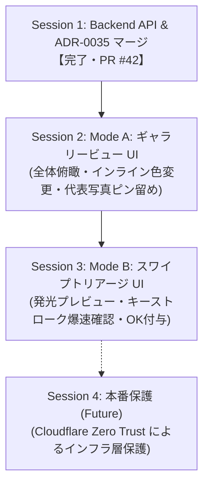

# 14. メタデータ編集機能・管理画面ロードマップおよび進捗整理ノート

- **ステータス**: 進行中 (In Progress)
- **日付**: 2026-10-08
- **現在の実装方針**: [ADR-0036](../../adr/0036-admin-gallery-and-bootstrap-master-extension.md)、[ADR-0037](../../adr/0037-metadata-edit-proposal-storage-and-approval.md)。以下の旧Session 1〜4は検討履歴であり、実装は末尾のPR単位ロードマップに従う。
- **関連 ADR**:
  - [ADR-0004: Go 構造体を唯一の Single Source of Truth とする型定義一元管理](../../adr/0004-go-schema-as-single-source-of-truth.md)
  - [ADR-0010: Google OIDC 認証とセッションセキュリティ (Deferred)](../../adr/0010-google-oidc-authentication-and-session-security.md)
  - [ADR-0014: RFC 7807 に準拠した最小 Problem Details エラーハンドリング](../../adr/0014-error-handling-and-minimal-problem-details.md)
  - [ADR-0017: リポジトリインターフェース集約と Pure Go SQLite アーキテクチャ](../../adr/0017-repository-interface-and-pure-go-sqlite-architecture.md)
  - [ADR-0021: GitOps マスターデータ同期とバージョン管理アーキテクチャ](../../adr/0021-gitops-master-data-synchronization-and-versioning-architecture.md)
  - [ADR-0024: 写真メタデータの人間参加型 (HITL) 策定プロセスの採用](../../adr/0024-photo-metadata-human-in-the-loop-architecture.md)
  - [ADR-0028: ADR コンプライアンステスト駆動アーキテクチャ](../../adr/0028-compliance-test-driven-adr-traceability-architecture.md)
  - [ADR-0035: メタデータ確認・編集 API および GitOps 逆同期アーキテクチャ](../../adr/0035-metadata-verification-and-editing-architecture.md)

---

## 1. 設計思想と決定事項 (Design Philosophy)

1. **「性善説での直接更新」×「クイズ利用者の安心感・信頼感」の両立**:
   - 通常画面に編集機能を露出させず、隠しパス `/admin` に隔離。
   - 一般プレイヤーには「公式データとして整備された信頼できるクイズ」としての安心感を提供。
   - 修正を行う管理者・協力者は、ログイン不要の `/admin` から 1 タップで即座に直せる軽快さを両立。
2. **万が一の安全弁の完備**:
   - 不正データが混入しても、Git 管理の正本シード（`seeds/seed.sql`）から 1 秒で完全復旧可能。
   - Cloudflare R2 への Litestream リアルタイムバックアップによりデータ保全を担保。
3. **可逆的 GitOps 連携 (Round-trip Sync)**:
   - SQLite 上で直した成果は、`scripts/export_seeds.go` により `seeds/data/members.json` へ逆エクスポートして PR 化・永続保全。

---

## 2. ここまでの進捗状況 (Current Status)

```
[Phase 1: Backend & ADR 完了 (PR #42)]
├── ① DB マイグレーション: members.verified_at カラム & インデックス追加 (000003)
├── ② Go モデル層: Member.VerifiedAt 追加 & 更新用 DTO 定義 (admin.go)
├── ③ リポジトリ層: GetMember, UpdateMemberPenlight, SetPrimaryImage 等の実装
├── ④ REST API: /api/v1/admin/members/{id} 等の 6 エンドポイント & CORS PATCH/PUT 許可
├── ⑤ GitOps ツール: SQLite から seeds/data/members.json への逆同期スクリプト (export_seeds.go)
├── ⑥ スキーマ同期: OpenAPI, TypeScript 型定義, ER 図への自動反映
└── ⑦ ADR & テスト: ADR-0035 起票 & コンプライアンステスト 100% パス
```

---

## 3. セッション分割ロードマップ (Session Roadmap)



### Session 1: Backend API & ADR-0035 マージ（完了・PR #42）
- **ゴール**: メタデータ確認・更新のための全基盤 API と ADR コンプライアンステストを完了させ、`main` に統合。
- **成果物**:
  - `ADR-0035`: メタデータ確認・編集 API および GitOps 逆同期アーキテクチャの採択
  - `pkg/repository/sqlite.go`: メタデータ更新・取得メソッド群
  - `pkg/server/server.go`: Admin REST エンドポイント群
  - `scripts/export_seeds.go`: シード逆同期スクリプト
  - `pkg/quiz/adr_compliance_test.go`: ADR-0035 コンプライアンステスト (100% PASS)

### Session 2: Mode A: ギャラリービュー UI（次期セッション・Frontend）
- **ゴール**: `/admin` 画面を作成し、グループ・期生全体のバランス俯瞰とインライン即時修正を可能にする。
- **実装内容**:
  - ルーティング: Next.js `/admin` ページの作成
  - 表示密度コントロール: 3 段階ズーム（Comfortable / Compact / Overview カラーマトリクス）
  - グループ・期生・ステータス（現役/卒業）切り替えフィルター
  - インライン編集:
    - 左右ワンクリック入替 (Swap 🔄)
    - 公式カラーパレット（Popover）からのワンタップ色変更
    - 代表写真のピン留め切り替え（`PUT /api/v1/admin/members/{id}/images/primary`）
    - 写真衣装タグの付け替え（`PATCH /api/v1/admin/images/{id}/photo-type`）
  - 楽観的 UI (Optimistic Update) によるノーレイテンシ操作感

### Session 3: Mode B: スワイプトリアージ UI（Frontend）
- **ゴール**: 実機同様の発光感を再現した大型カードで、1 人ずつ超高速に確認・OK を付与する。
- **実装内容**:
  - ネオングロー発光ペンライトのプレビュー表示（暗背景）
  - マッチングアプリ風カードスタック UI
  - キーボードショートカット:
    - `D` または `→`: OK（確認完了 ➔ `POST /admin/members/{id}/verify`）
    - `A` または `←`: 要修正（編集パレット展開）
    - `W` または `↑`: スキップ（保留）
    - `Z`: Undo（アンドゥ）
  - 未確認メンバー（`verified_at == null`）のみを優先トリアージするキュー機能

### Session 4: 将来的な `/admin` 保護（必要時対応・Infra / Security）
- **方針**:
  - アプリ側コードに認証ロジックを抱え込まず、**Cloudflare Zero Trust / Access**（インフラ層）で `/admin` パスに Google 認証 / OTP メール認証を設定して完全遮断する。

#### 調査結果（2026-10-08）

- Cloudflare Access の Self-hosted application は、ホスト名全体だけでなく URL パス単位で保護できる。既存の `penlight.aooba.net` を維持したまま、管理画面だけを認証対象にできる。
  - 公式: [Application paths](https://developers.cloudflare.com/cloudflare-one/access-controls/policies/app-paths/)
- 管理画面と管理 API は別パスのため、次の両方を保護対象にする。
  - `/admin` および `/admin/*`
  - `/api/v1/admin` および `/api/v1/admin/*`
- `/admin/*` のワイルドカードは親パス `/admin` を含まないため、親パスも明示的に保護する。管理 API も画面と同じ Access ポリシーを適用する。
- 通常のクイズ画面・クイズ API は公開のまま維持する。ホスト全体を保護すると Local-First のゲスト利用を壊すため採用しない。
- 認証方式は、Cloudflare 側に Google IdP を設定して管理者メールアドレスを Allow する方式を基本とする。少人数の協力者向けには、許可メールアドレスへ Cloudflare が送る One-time PIN を併用できる。
  - 公式: [Google IdP](https://developers.cloudflare.com/cloudflare-one/integrations/identity-providers/google/)
  - 公式: [One-time PIN](https://developers.cloudflare.com/cloudflare-one/integrations/identity-providers/one-time-pin/)
- Cloudflare Access は認証済みの HTTP リクエストだけを origin へ転送する。origin 迂回時も拒否できるよう、Cloudflare Tunnel の `Protect with Access` または origin 側の Access token 検証を有効化する。
  - 公式: [Self-hosted public application](https://developers.cloudflare.com/cloudflare-one/access-controls/applications/http-apps/self-hosted-public-app/)
- この方式では管理画面専用の `GOOGLE_CLIENT_ID` / `GOOGLE_CLIENT_SECRET` や Go 側の認証実装を追加しない。Cloudflare Access の設定は Cloudflare 側で管理し、既存の最小環境変数方針を維持する。

#### Session 4 の暫定仕様

> Cloudflare Access のパスベース保護を採用し、`/admin`、`/admin/*`、`/api/v1/admin`、`/api/v1/admin/*` を Google 認証または One-time PIN で保護する。通常のクイズ機能は公開のまま維持する。

#### 未実施事項

- Cloudflare Zero Trust 側の Access application、Allow ポリシー、Google IdP または One-time PIN の実設定。
- Tunnel の `Protect with Access` 設定および未認証状態での画面・管理 API の疎通確認。
- Cloudflare 側設定を Terraform/API 等で Git 管理するかどうかの決定。

---

## 4. PR単位ロードマップ（2026-10-08 更新）

1 PRを1セッションとして進める。ユーザー編集を提案として蓄積し、`/admin`で承認・却下する。初期は画面と管理APIの認証・認可を導入しない。PRのマージはユーザーが判断する。

| PR | 範囲 | 完了条件 |
|---|---|---|
| 1（今回） | ADR-0036/0037確定、提案保存のDB基盤 | migration 000004、型付き変更前後、`prp_`、メンバー・公開マスタのrevision、生成物同期、DB制約・移行・再起動テスト |
| 2 | 提案・承認BackendとBootstrap同期 | 送信・一覧・承認・却下、直接更新APIの置換、`include_graduated`・`photo_types`、条件別ETag、全マスタ更新経路のrevision整合 |
| 3 | ユーザー編集提案UI | 色・順序・期生・状態・代表写真・衣装タグの変更前後確認、同じ提案IDでの再送、承認待ちの表示 |
| 4 | `/admin`承認専用UI | 提案の変更前後・状態・競合表示、承認・却下、判断後の再取得 |
| 5 | 手動スナップショットとシード逆同期 | 整合性のあるSQLite snapshotを入力に、承認済みマスタだけを決定的に出力。取得と変換の分離、同じ入力の再実行・往復同期で不要な差分なし |

### PR 2で検証する境界

- 同一ID・同一内容の再送は既存結果、内容違いは拒否する。JSONキー順・画像変更配列の順序を正規化して比較する。
- 承認状態・公開マスタ・revisionを同一トランザクションで更新する。再承認・同時承認・revision競合・途中失敗で二重反映と部分更新がない。
- 未承認・却下では公開マスタとETagが変化しない。承認後は取得条件ごとに再取得できる。
- seed同期は同一内容の再適用でrevisionを増やさない。既存の画像全削除・再登録と`master_versions`の置換がrevisionをリセット／過剰更新しないよう整合させる。
- seedバージョンは起動時の同期判定に維持し、DB更新用の`data_revision`を分離する。Bootstrap本体とETagは同じDB状態から取得する。

### PR 5で検証する境界

- TypeID、左右順序、代表写真、衣装タグ、確認日時が往復で維持される。欠落した画像URLを架空のURLで補完しない。
- 出力の並び順はTypeID等で確定し、実行時刻を差分へ混入させない。pending・rejected・提案履歴をシードへ含めない。
- 変換処理は入力snapshotを更新しない。Kubernetes Job化は別ADRで決定する。

### 次セッションの引き継ぎ

- 起点: PR 1のマージ後の`main`から、PR 2用のトピックブランチを作成する。
- 保存基盤: `pkg/model/metadata_edit_proposal.go`、`migrations/000004_add_metadata_edit_proposals.up.sql`。DDLは`scripts/gen-proposal-migration.go`でモデルから生成する。
- 現状の制約: 提案Repository・API・UIは未実装。既存の直接更新API、Bootstrapの固定ETag、seed同期・`export_seeds.go`は旧実装であり、PR 1時点で承認フローが完成したとは扱わない。
- 旧WIP: 管理者向けメンバー／PhotoType一覧APIと`ListAllMembers`は取り下げた。参照はBootstrapの既存経路を拡張する。
- 生成パイプライン: TS型・ER図・今回のDDLを生成する。OpenAPIの自動生成経路はまだ存在しないため、PR 2のAPI契約変更時にADR-0004との同期方法を整備する。
- 別ADR: `/admin`・管理APIの保護、snapshot取得のKubernetes Job化。旧Session 4のCloudflare調査はその材料として保持する。
