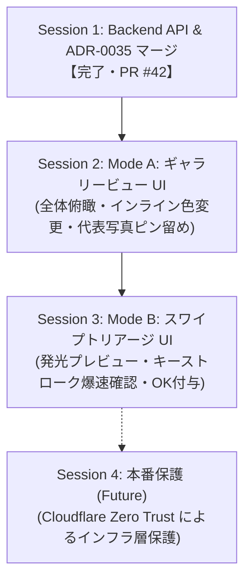

# 14. メタデータ編集機能・管理画面ロードマップおよび進捗整理ノート

- **ステータス**: 進行中 (In Progress)
- **日付**: 2026-10-08
- **関連 ADR**:
  - [ADR-0004: Go 構造体を唯一の Single Source of Truth とする型定義一元管理](../../adr/0004-go-schema-as-single-source-of-truth.md)
  - [ADR-0010: Google OIDC 認証とセッションセキュリティ (Deferred)](../../adr/0010-google-oidc-authentication-and-session-security.md)
  - [ADR-0014: RFC 7807 に準拠した最小 Problem Details エラーハンドリング](../../adr/0014-error-handling-and-minimal-problem-details.md)
  - [ADR-0017: リポジトリインターフェース集約と Pure Go SQLite アーキテクチャ](../../adr/0017-repository-interface-and-pure-go-sqlite-architecture.md)
  - [ADR-0021: GitOps マスターデータ同期とバージョン管理アーキテクチャ](../../adr/0021-gitops-master-data-synchronization-and-versioning-architecture.md)
  - [ADR-0024: 写真メタデータの人間参加型 (HITL) 策定プロセスの採用](../../adr/0024-photo-metadata-human-in-the-loop-architecture.md)
  - [ADR-0028: ADR コンプライアンステスト駆動アーキテクチャ](../../adr/0028-compliance-test-driven-adr-traceability-architecture.md)
  - [ADR-0035: メタデータ確認・編集 API および GitOps 逆同期アーキテクチャ](../../adr/0035-metadata-verification-and-editing-architecture.md)

---

## 1. 設計思想と決定事項 (Design Philosophy)

1. **「性善説での直接更新」×「クイズ利用者の安心感・信頼感」の両立**:
   - 通常画面に編集機能を露出させず、隠しパス `/admin` に隔離。
   - 一般プレイヤーには「公式データとして整備された信頼できるクイズ」としての安心感を提供。
   - 修正を行う管理者・協力者は、ログイン不要の `/admin` から 1 タップで即座に直せる軽快さを両立。
2. **万が一の安全弁の完備**:
   - 不正データが混入しても、Git 管理の正本シード（`seeds/seed.sql`）から 1 秒で完全復旧可能。
   - Cloudflare R2 への Litestream リアルタイムバックアップによりデータ保全を担保。
3. **可逆的 GitOps 連携 (Round-trip Sync)**:
   - SQLite 上で直した成果は、`scripts/export_seeds.go` により `seeds/data/members.json` へ逆エクスポートして PR 化・永続保全。

---

## 2. ここまでの進捗状況 (Current Status)

```
[Phase 1: Backend & ADR 完了 (PR #42)]
├── ① DB マイグレーション: members.verified_at カラム & インデックス追加 (000003)
├── ② Go モデル層: Member.VerifiedAt 追加 & 更新用 DTO 定義 (admin.go)
├── ③ リポジトリ層: GetMember, UpdateMemberPenlight, SetPrimaryImage 等の実装
├── ④ REST API: /api/v1/admin/members/{id} 等の 6 エンドポイント & CORS PATCH/PUT 許可
├── ⑤ GitOps ツール: SQLite から seeds/data/members.json への逆同期スクリプト (export_seeds.go)
├── ⑥ スキーマ同期: OpenAPI, TypeScript 型定義, ER 図への自動反映
└── ⑦ ADR & テスト: ADR-0035 起票 & コンプライアンステスト 100% パス
```

---

## 3. セッション分割ロードマップ (Session Roadmap)



### Session 1: Backend API & ADR-0035 マージ（完了・PR #42）
- **ゴール**: メタデータ確認・更新のための全基盤 API と ADR コンプライアンステストを完了させ、`main` に統合。
- **成果物**:
  - `ADR-0035`: メタデータ確認・編集 API および GitOps 逆同期アーキテクチャの採択
  - `pkg/repository/sqlite.go`: メタデータ更新・取得メソッド群
  - `pkg/server/server.go`: Admin REST エンドポイント群
  - `scripts/export_seeds.go`: シード逆同期スクリプト
  - `pkg/quiz/adr_compliance_test.go`: ADR-0035 コンプライアンステスト (100% PASS)

### Session 2: Mode A: ギャラリービュー UI（次期セッション・Frontend）
- **ゴール**: `/admin` 画面を作成し、グループ・期生全体のバランス俯瞰とインライン即時修正を可能にする。
- **実装内容**:
  - ルーティング: Next.js `/admin` ページの作成
  - 表示密度コントロール: 3 段階ズーム（Comfortable / Compact / Overview カラーマトリクス）
  - グループ・期生・ステータス（現役/卒業）切り替えフィルター
  - インライン編集:
    - 左右ワンクリック入替 (Swap 🔄)
    - 公式カラーパレット（Popover）からのワンタップ色変更
    - 代表写真のピン留め切り替え（`PUT /api/v1/admin/members/{id}/images/primary`）
    - 写真衣装タグの付け替え（`PATCH /api/v1/admin/images/{id}/photo-type`）
  - 楽観的 UI (Optimistic Update) によるノーレイテンシ操作感

### Session 3: Mode B: スワイプトリアージ UI（Frontend）
- **ゴール**: 実機同様の発光感を再現した大型カードで、1 人ずつ超高速に確認・OK を付与する。
- **実装内容**:
  - ネオングロー発光ペンライトのプレビュー表示（暗背景）
  - マッチングアプリ風カードスタック UI
  - キーボードショートカット:
    - `D` または `→`: OK（確認完了 ➔ `POST /admin/members/{id}/verify`）
    - `A` または `←`: 要修正（編集パレット展開）
    - `W` または `↑`: スキップ（保留）
    - `Z`: Undo（アンドゥ）
  - 未確認メンバー（`verified_at == null`）のみを優先トリアージするキュー機能

### Session 4: 将来的な `/admin` 保護（必要時対応・Infra / Security）
- **方針**:
  - アプリ側コードに認証ロジックを抱え込まず、**Cloudflare Zero Trust / Access**（インフラ層）で `/admin` パスに Google 認証 / OTP メール認証を設定して完全遮断する。
