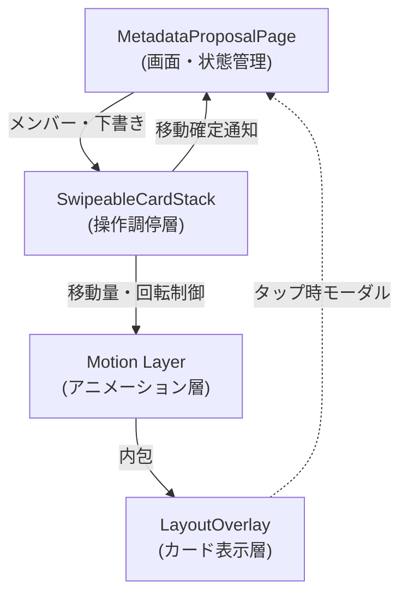

# 15. メンバーカードのスワイプ操作設計

- ステータス: 合意済み（ADR昇格待ち）
- 日付: 2026-10-09
- 対象: メタデータ編集画面のメンバー切り替え
- 関連: [note14](./14_metadata_editing_and_admin_roadmap.md)、[ADR-0037](../../adr/0037-metadata-edit-proposal-storage-and-approval.md)

## 1. 操作の意味とカードの動き

Tinderのように手前のカードを払うと背後のカードが現れる操作を採用する。写真・名前・ペンライトが一体で指に追従し、少し傾く。ヘッダーは固定する。

| 操作・状態 | 挙動 |
|---|---|
| 左にドラッグ | 次のメンバーのカードが背後から見える |
| 右にドラッグ | 前のメンバーのカードが背後から見える |
| 十分に引いて離す／短く素早く払う | 現在のカードがその方向へ抜け、背後のカードが手前に収まる |
| 途中で戻す／弱く引いて離す | 元の位置へ滑らかに戻り、メンバーは変わらない |
| 先頭で右／末尾で左 | 抵抗を感じる小さな移動に留め、離すと戻る。循環しない |

スワイプはメンバーの移動だけを行う。編集中の値はメンバーごとに保持し、提案の送信は明示的な操作で行う。note14の旧案にある管理者向け承認・却下のスワイプは対象外とする。

## 2. タップ編集・ドーナツ操作との共存

文字やペンライトの上からもカードをドラッグできる。触れた瞬間には編集を開かず、離すまでの動きでタップとドラッグを判定する。

| 操作・状態 | 挙動 |
|---|---|
| 文字・ペンライトに触れてそのまま離す | その項目の編集を開く。指の小さな揺れは許容する |
| 同じ場所から横に動かす | カードのドラッグに移行し、離しても編集を開かない |
| ドラッグ後に元の位置へ戻して離す | カードを戻す。編集は開かない |
| 縦方向だけに動かす | メンバーを切り替えない |
| 斜めに動かす | 横方向が主体の場合にカードのドラッグとして扱う |
| 編集画面・ドーナツ・フィルターなどのモーダル表示中 | 背後のカードを動かさず、開いているUIの操作を優先する |
| 送信・リセットなどのボタンを操作する | ボタン操作を優先し、その場所からカードのドラッグを開始しない |

一度ドラッグに移行した操作は、途中でキャンセルしてもタップとして扱わない。カード画面の縦スクロールは前提にしない。メンバー検索など、モーダル内のスクロールはカード操作から独立して扱う。

## 3. 下書き保持・連続操作・一覧の端での挙動

| 場面 | 挙動 |
|---|---|
| 編集して次へ進み、前へ戻る | 編集途中の値をそのまま表示する。移動時の確認ダイアログは出さない |
| カードを払った直後に、次のカードへ触れる | 次のカードが手前に出た時点で操作可能とし、退出するカードの演出完了は待たせない |
| 戻りアニメーション中に再び触れる | その位置でカードをつかみ直せる |
| 1回のスワイプ | 必ず1人だけ移動し、勢いで複数人を飛ばさない |
| フィルターや検索で対象が変わる | 進行中のドラッグを解除し、選ばれたメンバーを中央に表示する。下書きは保持する |
| 写真の読み込みが遅い・失敗する | 切り替えを止めず、代替表示を出す。前後の写真は先読みする |
| 指が離れた通知を受け取れないなど、操作が中断される | 移動確定前なら元のカードへ戻す。編集・送信は発生させない |

下書きは編集画面を開いている間、メンバーごとに保持する。再読み込み後の復元とその保存方式は本設計の対象外とする。一覧の先頭・末尾では第1節の抵抗と復帰を適用する。

## 4. 実装方式の比較と検証条件

### 実装方式の選定

| 方式 | 利点 | 負担・懸念 | 採否 |
|---|---|---|---|
| ブラウザ標準（Pointer Events + CSS） | 追加依存ゼロ | 速度・加速度の計算、割り込み（つかみ直し）、スプリング復帰をすべて自前管理する必要があり保守コストが高い | 見送り |
| **Motion (`motion/react`)** | `useMotionValue` によるゼロ再描画追従、スプリング物理演算、割り込みアニメーションが堅牢 | パッケージ追加（約 30KB gzipped） | **採用** |

### コンポーネントの責務分離

既存のカード表示・モーダルを汚染せず、スワイプ操作とアニメーションを疎結合に分離する。

- **`MetadataProposalPage` (画面・状態管理層)**:
  - メンバーの順序、現在のメンバー、下書き（`drafts`）、提案送信・API 通信を管理。スワイプや物理演算の詳細を知らない。
- **`SwipeableCardStack` (操作調停層)**:
  - 手前と背後の 2 枚のカードを管理。
  - ポインターの微小ブレ（< 10px）はタップとして子要素へ通し、10px 以上の移動でスワイプに移行。
  - 一覧の先頭・末尾での抵抗と非循環復帰を制御し、完了時に画面層へインデックス変更を通知（`onSwipeNext` / `onSwipePrev`）。
- **`Motion Layer` (アニメーション層)**:
  - `motion/react` の `motion.div` や `useMotionValue` を用い、React の再描画を伴わずに 60/120fps で指に追従・回転・スプリング復帰。
- **`LayoutOverlay` (カード表示層)**:
  - 既存の表示コンポーネント。スワイプの存在を意識せず、渡されたメンバー・下書きの表示とタップ時のモーダル呼び出しに専念。

### 検証条件・完了定義

1. **自動テスト (Playwright E2E)**:
   - 左右スワイプによる前後メンバーの切り替え。
   - リスト先頭で右スワイプ・末尾で左スワイプ時の境界復帰（循環しないこと）。
   - スワイプ移動後の下書き（ドラフト）保持。
   - 短いタップ（バッジ・ペンライト）で正しくモーダルが開き、誤ったスワイプ確定が発生しないこと。
2. **実機検証 (iOS Safari / Android Chrome)**:
   - ゆっくり引く、素早く払う、途中で戻す、連続して払う、復帰アニメーション中のつかみ直しが破綻なく追従すること。
   - 画面端の「戻る/進む」スワイプジェスチャーと競合しないこと。
3. **アクセシビリティ**:
   - `prefers-reduced-motion` が有効な場合は傾き・大きな退出演出を抑止。
   - 前後ボタン（`前へ` / `次へ`）およびキーボードによる移動手段を常時提供。
4. **パラメータ調整**:
   - 移動距離・閾値・速度・傾き角などの具体的な数値は実機でチューニングし、ADR には過剰に数値を固定しない。

